## A. Lý thuyết

## 1. Hàm số $y=\sin x$

- Tập xác định $\mathrm{D}=\mathrm{R}$
- Tập giá trị $T=[-1 ; 1]$ tức là $-1 \leq \sin x \leq 1$
- Hàm số tuần hoàn với chu kì $2 \pi$ tức là $\sin (x+k 2 \pi)=\sin x$ với $k \in Z$
- Hàm số đồng biến trên mỗi khoảng $\left(-\frac{\pi}{2}+k 2 \pi ; \frac{\pi}{2}+k 2 \pi\right)$ và nghịch biến trên mỗi khoảng $\left(\frac{\pi}{2}+k 2 \pi ; \frac{3 \pi}{2}+k 2 \pi\right), k \in Z$
- Là hàm số lẻ nên đồ thị hàm số nhận gốc tọa độ $O$ làm tâm đối xứng
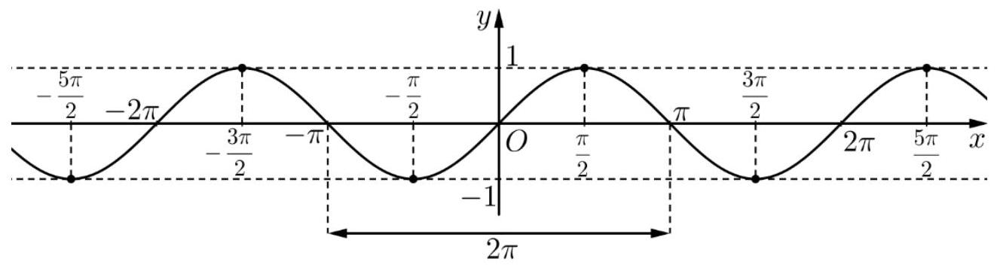

## 2. Hàm số $y=\cos x$

- Tập xác định $\mathrm{D}=\mathrm{R}$
- Tập giá trị $T=[-1 ; 1]$ tức là $-1 \leq \cos x \leq 1$
- Hàm số tuần hoàn với chu kì $2 \pi$ tức là $\cos (x+k 2 \pi)=\cos x$ với $k \in Z$
- Hàm số đồng biến trên mỗi khoảng $(-\pi+k 2 \pi ; k 2 \pi)$ và nghịch biến trên mỗi khoảng $(\mathrm{k} 2 \pi ; \pi+\mathrm{k} 2 \pi), k \in \mathbb{Z}$
- Là hàm số chẵn nên đồ thị nhận trục tung làm trục đối xứng.

Với mọi $x \in \mathbb{R}$ ta có đẳng thức $\sin \left(x+\frac{\pi}{2}\right)=\cos x$.
Từ đó, bằng cách tịnh tiến đồ thị hàm số $y=\sin x$ theo vectơ $\overrightarrow{\mathrm{u}}=\left(-\frac{\pi}{2} ; 0\right)$ (sang trái một đoạn có độ dài bằng $\frac{\pi}{2}$, song song với trục hoành), ta được đồ thị của hàm số $y=\cos x$

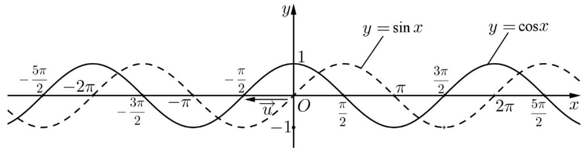

## 3. Hàm số $y=\tan x$

- Tập xác định $\mathrm{D}=\mathrm{R} \backslash\left\{\frac{\pi}{2}+\mathrm{k} \pi, \mathrm{k} \in \mathbb{Z}\right\}$
- Tập giá trị $T=R$
- Là hàm số tuần hoàn với chu kì $\pi$ tức là $\tan (\mathrm{x}+\mathrm{k} \pi)=\tan \times$ với $\mathrm{k} \in \mathrm{Z}$
- Hàm số đồng biến trên mỗi khoảng $\left(-\frac{\pi}{2}+\mathrm{k} \pi ; \frac{\pi}{2}+\mathrm{k} \pi\right)$ với $\mathrm{k} \in \mathrm{Z}$
- Là hàm số lẻ nên đồ thị hàm số nhận gốc tọa độ $O$ làm tâm đối xứng.
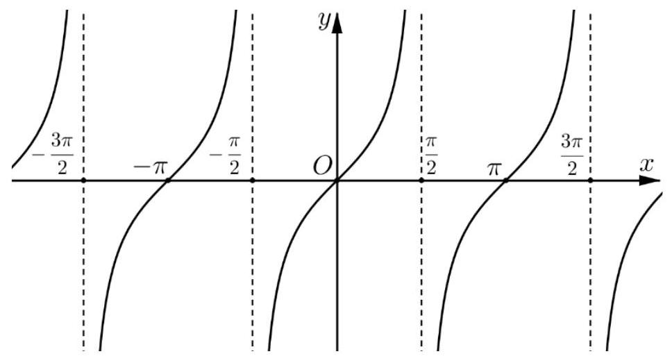

## 4. Hàm số $y=\cot x$

- Tập xác định $\mathrm{D}=\mathrm{R} \backslash\{\mathrm{k} \pi, \mathrm{k} \in \mathbb{Z}\}$
- Tập giá trị $T=R$
- Là hàm số tuần hoàn với chu kì $\pi$ tức là $\cot (\mathrm{x}+\mathrm{k} \pi)=\operatorname{cotx}$ với $\mathrm{k} \in Z$
- Hàm số nghịch biến trên mỗi khoảng $(\mathrm{k} \pi ; \pi+\mathrm{k} \pi)$ với $\mathrm{k} \in \mathrm{Z}$
- Là hàm số lẻ nên đồ thị hàm số nhận gốc tọa độ $O$ làm tâm đối xứng.

Ôn tập kiến thức toán 10-11-12
Luyện thi THPTQG và ĐGNL

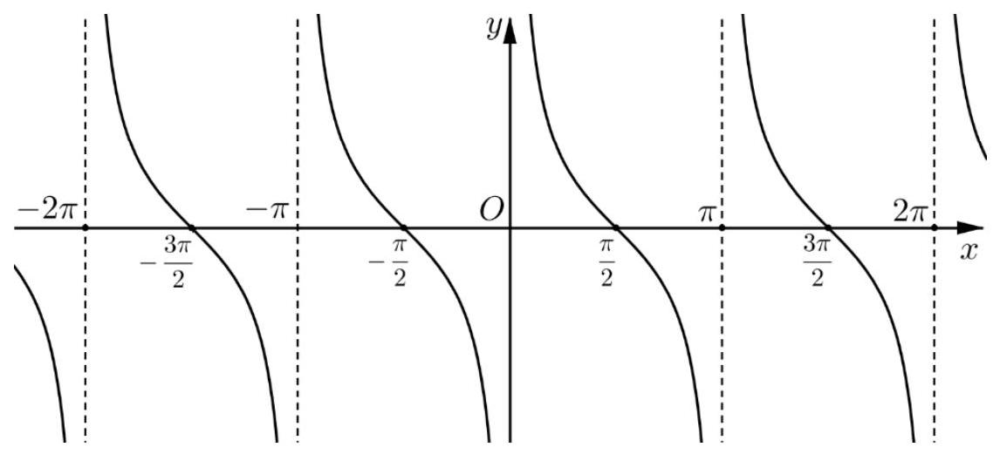
Dạng 1 - Tìm tập xác định

| HÀM SỐ | ĐIỀU KIỆN XÁC ĐỊNH |
| :--- | :--- |
| $y=\frac{f(x)}{g(x)}$ | $\mathbf{g}(\mathbf{x}) \neq 0$ |
| $y=\sqrt[2 n]{x}$ với $n \in N^{*}$ | $\mathrm{x} \geq 0$ |
| $y=\frac{1}{\sqrt[2 n]{x}}$ với $n \in N^{*}$ | $\mathbf{f} \boldsymbol{(} \mathbf{x} \boldsymbol{)} \boldsymbol{>} \mathbf{0}$ |
| $y=\sin [u(x)]$ | u(x)xác định |
| $y=\cos [u(x)]$ | u(x) xác định |
| $y=\tan x$ | $x \neq \frac{\pi}{2}+k \pi$ với $k \in Z$ |
| $y=\cot x$ | $\times \boldsymbol{k} \mathbf{k} \boldsymbol{\pi}$ với $\mathbf{k} \boldsymbol{\in} \mathbf{Z}$ |

Lưu ý
A. Hàm số có mẫu số đặc biệt

1. $\sin u \neq 0 \Leftrightarrow u \neq k \pi$
2. $\cos u \neq 0 \Leftrightarrow u \neq \frac{\pi}{2}+k \pi$
3. $\sin u \neq 1 \Leftrightarrow u \neq \frac{\pi}{2}+k 2 \pi$
4. $\cos u \neq 1 \Leftrightarrow u \neq k 2 \pi$
5. $\sin u \neq-1 \Leftrightarrow u \neq-\frac{\pi}{2}+k 2 \pi$
6. $\cos u \neq-1 \Leftrightarrow u \neq \pi+k 2 \pi$
fb.me/loptoancachep 0948.215.040 (thầy Huy)

## B. Biết cách sử dụng đường tròn lượng giác

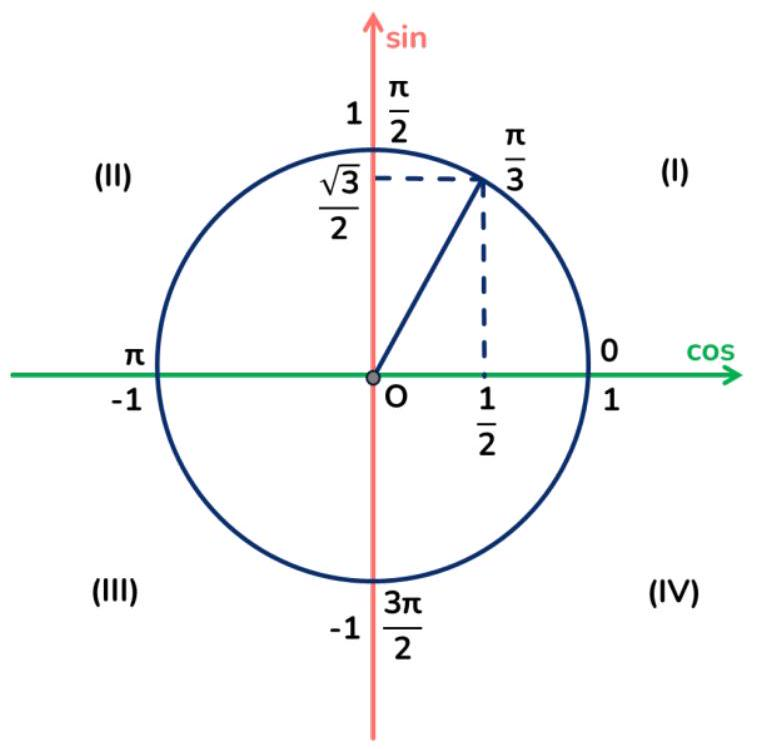

## Dạng 2 - Xác định tính chẵn lẻ

Bước 1. Tìm tập xác định $D$
Bước 2. Xét tập xác định D

- Nếu D là tập đối xứng (tức là $\forall x \in \mathrm{D} \Rightarrow-x \in \mathrm{D}$ ) thì ta thực hiện Bước 3.
- Nếu $D$ không là tập đối xứng ( $\exists x \in D$ mà $-x \notin D$ ), ta kết luận hàm số không chẵn, không lẻ.

Bước 3. Xác định $\mathrm{f}(-\mathrm{x})$

- Nếu $f(-x)=f(x)$ thì ta kết luận hàm số là hàm chẵn.
- Nếu $f(-x)=-f(x)$ thì ta kết luận hàm số là hàm lẻ.
- Nếu $\left\{\begin{array}{l}f(-x) \neq f(x) \\ f(-x) \neq-f(x)\end{array}\right.$ thì ta kết luận hàm số không chẵn, không lẻ.

Lúc đó ta chỉ câ̂n chỉ ra điểm $x_{0} \in \mathrm{D}$ thỏa mãn hệ thức trên

## Lưu ý

1. Các hàm số đặc biệt

- Hàm số $y=\sin x$ là hàm số lẻ
- Hàm số $y=\tan x$ là hàm số lẻ
- Hàm số $y=\cos x$ là hàm số chẵn
- Hàm số $y=\operatorname{cotx}$ là hàm số lẻ

2. Nhắc lại kiến thức

- $|-x|=x$
- $(a-b)^{2 n+1}=-(b-a)^{2 n+1}$ với $\mathrm{n} \in \mathrm{N}^{*}$
- $(a-b)^{2 n}=(b-a)^{2 n}$ với neN*

3. Sử dụng máy tính cầm tay

Bước 1. Nhập hàm số vào máy tính
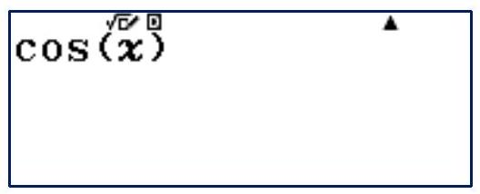

Bước 2. Bấm CALC $\rightarrow x=1 \rightarrow=\rightarrow$ Ghi lại kết quả
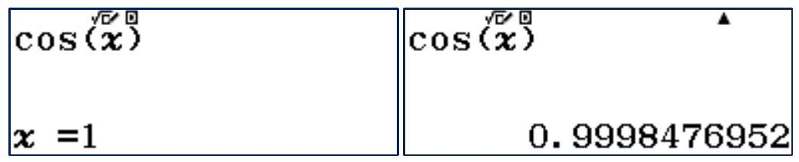

Bước 3. Bấm CALC $\rightarrow x=-1 \rightarrow=\rightarrow$ Ghi lại kết quả
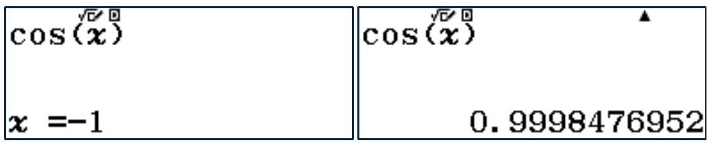

Bước 4. So sánh 2 kết quả và đưa ra kết luận

Ví dụ: như trong hình ở bước 2 và bước 3 được kết quả giống nhau nên là hàm số chẵn.

## Dạng 3 - Xác định giá trị lớn nhất, giá trị nhỏ nhất

## - Nhắc lại kiến thức

Bước 1. Rút gọn hàm số lượng giác, đưa về hằng đẳng thức, ...
Bước 2. Kết hợp một số tính chất của bất đẳng thức để đưa về hàm số ở Bước $\mathbf{1}$ và đánh giá

- $a \leq b \Leftrightarrow b \geq a$
- $a \leq b \Leftrightarrow a+c \leq b+c$
- $\left\{\begin{array}{l}a \leq b \\ b \leq c\end{array} \Rightarrow a \leq c\right.$
- $\left\{\begin{array}{l}a \leq b \\ c \leq d\end{array} \Rightarrow a+c \leq b+d\right.$
- $a \leq b \Leftrightarrow\left[\begin{array}{l}a . c \leq b . c(c>0) \\ a . c \geq b . c(c<0)\end{array}\right.$
- $a>b>0 \Leftrightarrow \frac{1}{a}<\frac{1}{b}$

1. Sử dụng miền giá trị của hàm số lượng giác

- $-1 \leq \sin x \leq 1 ;-1 \leq \cos x \leq 1$
- $0 \leq \sin ^{2} x \leq 1 ; 0 \leq \cos ^{2} x \leq 1$
- $0 \leq|\sin x| \leq 1 ; 0 \leq|\cos x| \leq 1$
- $0 \leq \sqrt{\sin x} \leq 1 ; 0 \leq \sqrt{\cos x} \leq 1$

2. Điều kiện có nghiệm của phương trình cơ bản $a \sin x+b \cos x=c$ là $a^{2}+b^{2} \geq c^{2}$.

- Hàm số $y=a \sin [f(x)]+b \cos [f(x)]$ thì $\max y=\sqrt{a^{2}+b^{2}}$, $\min y=-\sqrt{a^{2}+b^{2}}$.
- Hàm số $y=a \sin [f(x)]+b \cos [f(x)]+c$ thì $\max y=\sqrt{a^{2}+b^{2}}+c, \min y=-\sqrt{a^{2}+b^{2}}+c$.
- Hàm số $y=\frac{a_{1} \sin x+b_{1} \cos x+c_{1}}{a_{2} \sin x+b_{2} \cos x+c_{2}}$ thì ta tìm miền xác định của hàm số, rồi quy đồng mẫu số, đưa về phương trình dạng $a \sin x+b \cos x=c$.

3. Sử dụng các bất đẳng thức.

- Bất đẳng thức AM-GM: Cho hai số thực $a, b>0$, ta có $\frac{a+b}{2} \geq \sqrt{a b}$, dấu bằng xảy ra khi $a=b$.
- Bất đẳng thức Bunyakovsky: $\left(a^{2}+b^{2}\right)\left(c^{2}+d^{2}\right) \geq(a c+b d)^{2}$, dấu bằng xảy ra khi $\frac{a}{c}=\frac{b}{d}$.

4. Sử dụng tính chất của hàm bậc hai $y=a x^{2}+b x+c$

- Nếu $a<0$ thì $a x^{2}+b x+c \leq \frac{-\Delta}{4 a}$ dấu bằng xảy ra khi $x=-\frac{b}{2 \mathrm{a}}$
- Nếu $a>0$ thì $a x^{2}+b x+c \geq \frac{-\Delta}{4 a}$ dấu bằng xảy ra khi $x=-\frac{b}{2 \mathrm{a}}$

## Mẹo

Bước 1. Vào table (MODE → 7 hoặc MODE $\rightarrow 8$ ) - ĐƠN VỊ MÁY LÀ RADIAN
Bước 2. Nhập hàm số vào $f(x)$
Ví dụ ở đây ta xét hàm $y=\sin x$
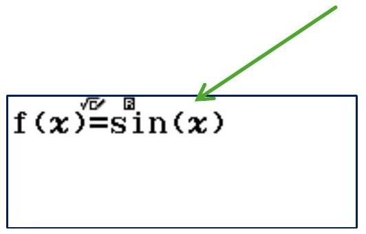

Bước 3. Ở phạm vi bảng Bắt đầu: nhập 0
Kết thúc: nhập $2 \pi$
Bước: nhập $2 \pi: 20$

|  | $2 \pi \div 20$ |  |  |  |  |
| :--- | :--- | :--- | :--- | :--- | :--- |
|  |  |  |  |  |  |
|  |  |  |  |  |  |
|  |  |  |  |  |  |

Bước 4. Dò kết quả ở cột $f(x)$ và kết luận:
Số lớn nhất sẽ là giá trị lớn nhất - Số nhỏ nhất sẽ là giá trị nhỏ nhất.
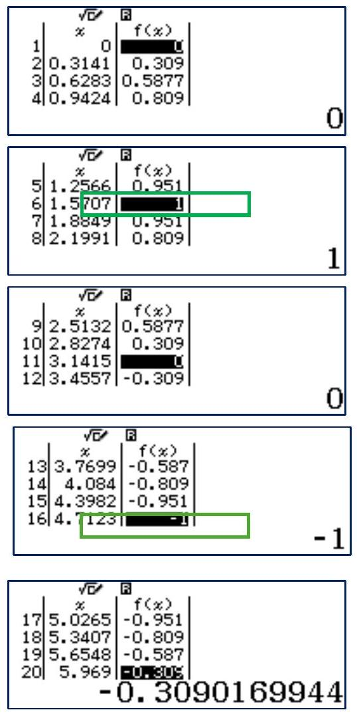

Dễ thấy: Tại hàng thứ 6 , khi $x=1,5707$ thì $f(x)=1$ là giá trị lớn nhất
Tại hàng thứ 16 , khi $x=4,7123$ thì $f(x)=-1$ là giá trị nhỏ nhất
fb.me/loptoancachep

Lưu ý: tùy đề bài xét trên khoảng nào mà thay đổi khoảng nhập ở bước 3
Trong B3, phần bước luôn lấy giá trị "kết thúc" trừ giá trị "bắt đầu" và chia 20.

## Dạng 4 - Xác định chu kì

- Nhắc lại kiến thức
- Hàm số $y=\sin (a x+b), y=\cos (a x+b)$ có chu kỳ $T_{0}=\frac{2 \pi}{|a|}$.
- Hàm số $y=\tan (a x+b), y=\cot (a x+b)$ có chu kỳ $T_{0}=\frac{\pi}{|a|}$.

1. $T_{0}>0$ và là nhỏ nhất.
2. Nếu hàm số $y=f_{1}(x)$ có chu kỳ $T_{1}$, hàm số $y=f_{2}(x)$ có chu kỳ $T_{2}$ thì hàm số $y=f_{1}(x) \pm f_{2}(x)$ có chu kỳ $T_{0}$, tới $T_{0}$ là bội chung nhỏ nhất của $T_{1}$ và $T_{2}$.

## Mẹo

Bước 1. Nhập hàm số vào máy
Ví dụ. Xác định chu kì hàm số $y=\cot 6 x+\sin 8 x$

$$
\frac{1^{\sqrt{6}}}{\tan (6 x)}+\sin (8 x)
$$

A. $\pi$
B. $\frac{\pi}{4}$
C. $\frac{\pi}{2}$
D. $\frac{\pi}{6}$

Bước 2. Bấm CALC $\rightarrow x=1 \rightarrow=\rightarrow$ Ghi lại kết quả

$$
\begin{array}{|r|}
\frac{1}{\tan (6 x)}+\sin (8 x) \\
-2.446994758 \\
\hline
\end{array}
$$

Bước 3. Bấm CALC $\rightarrow x=1$ + đáp án $\rightarrow=$ : giống kết quả bước 2 thì chọn (thử từ đáp án nhỏ nhất)
Ví dụ. Ta thấy $\frac{\pi}{6}<\frac{\pi}{4}<\frac{\pi}{2}<\pi$ nên thử từ $\frac{\pi}{6}$

$$
\begin{aligned}
& \frac{1^{\sqrt{ }}}{\tan (6 x)}+\sin (8 x) \\
& x=1+\pi \div 6
\end{aligned}
$$

$$
\begin{array}{r}
\frac{1}{\tan (6 x)}+\sin (8 x) \\
-3.805025402
\end{array}
$$

Kết quả không giống bước 2 nên thử tiếp $\frac{\pi}{2}$

$$
\begin{aligned}
& \frac{1}{\tan (6 x)}+\sin (8 x) \\
& x=1+\pi \div 4
\end{aligned}
$$

$$
\frac{1^{\sqrt{2}}}{\tan (6 x)}+\sin (8 x)
$$

1.280364438

Kết quả không giống bước 2 nên thử tiếp $\frac{\pi}{2}$

Ôn tập kiến thức toán 10-11-12
Luyện thi THPTQG và ĐGNL

fb.me/loptoancachep 0948.215.040 (thầy Huy)

$$
\begin{aligned}
& \frac{1^{\sqrt{2}}}{\tan (6 x)}+\sin (8 x) \\
& x=1+\pi \div 2
\end{aligned}
$$

$$
\begin{array}{r}
\frac{1^{\sqrt{8}}}{\tan (6 x)}+\sin (8 x) \\
-2.446994758
\end{array}
$$

## Ta được kết quả như bước 2 nên chọn $C$

## Lỗi sai thường mắc phải

Nếu ta thử đáp án $A$. $\pi$ trước - vẫn sẽ nhận được kết quả giống bước 2 nhưng đây không phải là chu kì cần tìm

$$
\begin{aligned}
& \frac{1}{\tan (6 x)}+\sin (8 x) \\
& x=1+\pi
\end{aligned}
$$

$$
\begin{array}{r}
\frac{1}{\sqrt{\bar{t}} \tan (6 x)}+\sin (8 x) \\
-2.446994758 \\
\hline
\end{array}
$$

## Dạng 5 - Tính đơn điệu

## - Nhắc lại kiến thức

- Hàm số $y=\sin x$ đồng biến trên nửa đường tròn bên phải và nghịch biến trên nửa đường tròn bên trái.

Tức là đồng biến mỗi khoảng $\left(-\frac{\pi}{2}+k 2 \pi ; \frac{\pi}{2}+k 2 \pi\right)$, nghịch biến trên mỗi khoảng

$$
\left(\frac{\pi}{2}+k 2 \pi ; \frac{3 \pi}{2}+k 2 \pi\right), k \in Z
$$

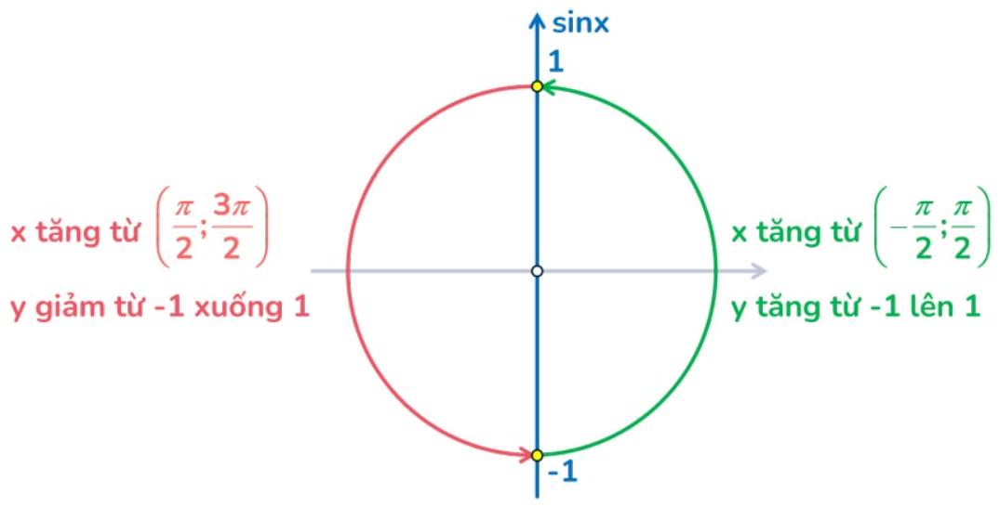

- Hàm số $y=\cos x$ đồng biến trên nửa đường tròn bên dưới và nghịch biến trên nửa đường tròn bên trên.

Tức là đồng biến mỗi khoảng ( $-\pi+k 2 \pi ; k 2 \pi$ ), nghịch biến trên mỗi khoảng ( $k 2 \pi ; \pi+k 2 \pi$ ), k $\in Z$
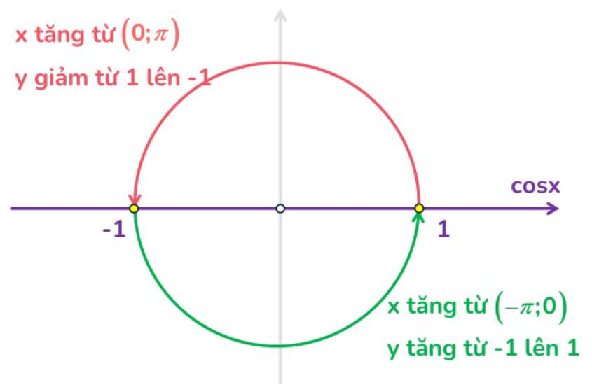

- Hàm số $y=\tan x$ luôn đồng biến trên từng khoảng xác định

Tức là đồng biến mỗi khoảng $\left(-\frac{\pi}{2}+k \pi ; \frac{\pi}{2}+k \pi\right)$ với $k \in Z$

## Mẹo

Bài toán. Muốn xét sự đồng biến, nghịch biến của hàm số $y=f(x)$ trên khoảng (a;b)
Bước 1. Vào table (MODE $\rightarrow 7$ hoặc $M O D E \rightarrow 8$ ) nhập hàm $f(x)$
Bước 2. Ở phạm vi bảng: Bắt đầu: nhập a

> Kết thúc: nhập b
> Bước: nhập (b-a):20

Bước 3. Quan sát cột $f(x)$ : tăng là đồng biến - giảm là nghịch biến
> kết luận dựa vào khoảng tương ứng

Chú ý: máy để đúng đơn vị góc với (a;b)

Ví dụ. Xét tính đơn điệu của hàm số $y=\sin x+\cos x$ trên khoảng $\left(0 ; \frac{\pi}{2}\right)$

Bước 1. Nhập hàm số vào bảng

Bước 2. Ở phạm vi bảng, nhập như hình

$$
f(x)=\sin ^{\sqrt{\sigma}}(x)+\cos (x
$$

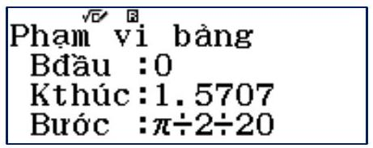

Bước 3. Quan sát được các kết quả
f(x) tăng
f(x) tăng
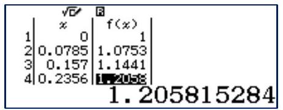
f(x) tăng đến hàng 11
thì $f(x)$ bắt đầu giảm lại
dò nhanh tới hàng 21 vẫn giảm về 1
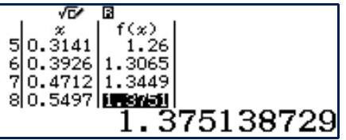
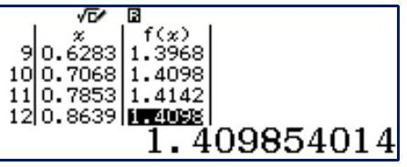
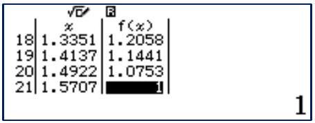

Vậy hàm số đồng biến trên từ hàng 1 đến 11 , tức là $x \in(0 ; 0,78) \sim\left(0 ; \frac{\pi}{4}\right)$

Ôn tập kiến thức toán 10-11-12
Luyện thi THPTQG và ĐGNL

fb.me/loptoancachep 0948.215.040 (thầy Huy)
nghịch biến trên từ hàng 11 đến 20 tức là $x \in\left(\frac{\pi}{4} ; \frac{\pi}{2}\right)$

## C. Bài tập trắc nghiệm

## Dang 1. TìM TÂP XÁC DINH CÚA HÀM SÓ

Câu 1. Tập xác định D của hàm số $y=2 \sin x$ là
A. $D=-2 ; 2$.
B. $\mathrm{D}=-1 ; 1$.
C. $\mathrm{D}=0 ; 2$.
D. $D=\mathbb{R}$.

## Lời giải. Chọn D.

Câu 2. Tập xác định D của hàm số $y=\cos \sqrt{x}$ là
A. $\mathrm{D}=-1 ; 1$.
B. $\mathrm{D}=0 ; 1$.
C. $\mathrm{D}=0 ;+\infty$.
D. $D=\mathbb{R}$.

Lời giải. Điều kiện xác định $x \geq 0$. Do đó $\mathrm{D}=0 ;+\infty$. Chọn C.

Câu 3. Trên $0 ; 2 \pi$ có bao nhiêu điểm mà hàm số $y=\cos x+\frac{2021}{\sin x}$ không xác định?
A. 2 .
B. 3 .
C. 5 .
D. Vô số.

Lời giải. Hàm số xác định $\Leftrightarrow \sin x \neq 0 \Leftrightarrow x \neq k \pi \quad k \in \mathbb{Z}$.
Do đó trên đoạn $0 ; 2 \pi$ các điểm mà hàm số không xác định là $0, \pi$ và $2 \pi$. Chọn B.

Câu 4. Tập xác định $D$ của hàm số $y=\frac{2}{\sin \left(x-\frac{\pi}{3}\right)}$ là
A. $\mathrm{D}=\mathbb{R} \backslash\left\{\frac{\pi}{3}+k \pi, k \in \mathbb{Z}\right\}$.
B. $\mathrm{D}=\mathbb{R} \backslash\left\{\frac{\pi}{3}+k 2 \pi, k \in \mathbb{Z}\right\}$.
C. $\mathrm{D}=\mathbb{R} \backslash k 2 \pi, k \in \mathbb{Z}$.
D. $\mathrm{D}=\mathbb{R} \backslash k \pi, k \in \mathbb{Z}$.

Lời giải. Hàm số xác định $\Leftrightarrow \sin \left(x-\frac{\pi}{3}\right) \neq 0 \Leftrightarrow x-\frac{\pi}{3} \neq k \pi \quad k \in \mathbb{Z}$. Chọn $\mathbf{A}$.

Câu 5. Tập xác định $D$ của hàm số $y=\frac{2021-\sin x}{\cos x-1}$ là
A. $\mathrm{D}=\mathbb{R}$.
B. $\mathrm{D}=\mathbb{R} \backslash\left\{\frac{\pi}{2}+k \pi, k \in \mathbb{Z}\right\}$.
C. $\mathrm{D}=\mathbb{R} \backslash k \pi, k \in \mathbb{Z}$.
D. $\mathrm{D}=\mathbb{R} \backslash k 2 \pi, k \in \mathbb{Z}$.

Lời giải. Hàm số xác định $\Leftrightarrow \cos x-1 \neq 0 \Leftrightarrow \cos x \neq 1 \Leftrightarrow x \neq k 2 \pi \quad k \in \mathbb{Z}$. Chọn D.

Câu 6. Trên $\left(-\frac{\pi}{2} ; \frac{3 \pi}{2}\right)$ có bao nhiêu điểm mà hàm số $y=\frac{2021}{\sin ^{2} x-1}$ không xác định?
A. 0 .
B. 1 .
C. 2 .
D. 3 .

Lời giải. Hàm số xác định $\Leftrightarrow \sin ^{2} x \neq 1 \Leftrightarrow \sin x \neq \pm 1 \Leftrightarrow x \neq \frac{\pi}{2}+k \pi \quad k \in \mathbb{Z}$.
Do đó trên đoạn $\left(-\frac{\pi}{2} ; \frac{3 \pi}{2}\right)$ điểm mà hàm số không xác định là $\frac{\pi}{2}$. Chọn B.

Câu 7. Tập xác định D của hàm số $y=\cot \left(2 x-\frac{\pi}{4}\right)+\sin 2 x$ là
A. $\mathrm{D}=\varnothing$.
B. $\mathrm{D}=\mathbb{R}$.
C. $\mathrm{D}=\mathbb{R} \backslash\left\{\frac{\pi}{8}+k \frac{\pi}{2}, k \in \mathbb{Z}\right\}$.
D. $\mathrm{D}=\mathbb{R} \backslash\left\{\frac{\pi}{4}+k \pi, k \in \mathbb{Z}\right\}$.

Lời giải. Hàm số xác định $\Leftrightarrow \cot \left(2 x-\frac{\pi}{4}\right)$ xác định $\Leftrightarrow \sin \left(2 x-\frac{\pi}{4}\right) \neq 0$

$$
\Leftrightarrow 2 x-\frac{\pi}{4} \neq k \pi \Leftrightarrow x \neq \frac{\pi}{8}+\frac{k \pi}{2} \quad k \in \mathbb{Z} \text {. Chọn C. }
$$

Câu 8. Tập xác định D của hàm số $y=3 \tan ^{2}\left(\frac{x}{2}-\frac{\pi}{4}\right)$ là

Ôn tập kiến thức toán 10-11-12
Luyện thi THPTQG và ĐGNL

A. $\mathrm{D}=\mathbb{R} \backslash\left\{\frac{3 \pi}{2}+k 2 \pi, k \in \mathbb{Z}\right\}$.
B. $\mathrm{D}=\mathbb{R} \backslash\left\{\frac{\pi}{2}+k 2 \pi, k \in \mathbb{Z}\right\}$.
C. $\mathrm{D}=\mathbb{R} \backslash\left\{\frac{3 \pi}{2}+k \pi, k \in \mathbb{Z}\right\}$.
D. $\mathrm{D}=\mathbb{R} \backslash\left\{\frac{\pi}{2}+k \pi, k \in \mathbb{Z}\right\}$.

Lời giải. Hàm số xác định $\Leftrightarrow \tan ^{2}\left(\frac{x}{2}-\frac{\pi}{4}\right)$ xác định $\Leftrightarrow \cos ^{2}\left(\frac{x}{2}-\frac{\pi}{4}\right) \neq 0$

$$
\Leftrightarrow \frac{x}{2}-\frac{\pi}{4} \neq \frac{\pi}{2}+k \pi \Leftrightarrow x \neq \frac{3 \pi}{2}+k 2 \pi \quad k \in \mathbb{Z} \text {. Chọn A. }
$$

Câu 9. Tập xác định D của hàm số $y=2020 \tan ^{2021} 2 x$ là
A. $\mathrm{D}=\mathbb{R} \backslash\left\{\frac{\pi}{2}+k \pi, k \in \mathbb{Z}\right\}$.
B. $\mathrm{D}=\mathbb{R} \backslash\left\{k \frac{\pi}{2}, k \in \mathbb{Z}\right\}$.
C. $D=\mathbb{R}$.
D. $\mathrm{D}=\mathbb{R} \backslash\left\{\frac{\pi}{4}+k \frac{\pi}{2}, k \in \mathbb{Z}\right\}$.

Lời giải. Hàm số xác định $\Leftrightarrow \tan ^{2021} 2 x$ xác định $\Leftrightarrow \cos ^{2021} 2 x \neq 0 \Leftrightarrow \cos 2 x \neq 0$

$$
\Leftrightarrow 2 x \neq \frac{\pi}{2}+k \pi \Leftrightarrow x \neq \frac{\pi}{4}+k \frac{\pi}{2} \quad k \in \mathbb{Z} \text {. Chọn D. }
$$

Câu 10. Tập xác định D của hàm số $y=\tan x-\cot 2 x$ là
A. $\mathrm{D}=\mathbb{R} \backslash\left\{k \frac{\pi}{4}, k \in \mathbb{Z}\right\}$.
B. $\mathrm{D}=\mathbb{R} \backslash\left\{k \frac{\pi}{2}, k \in \mathbb{Z}\right\}$.
C. $\mathrm{D}=\mathbb{R} \backslash k \pi, k \in \mathbb{Z}$.
D. $\mathrm{D}=\mathbb{R} \backslash k 2 \pi, k \in \mathbb{Z}$.

Lời giải. Chọn B. Hàm số xác định khi thỏa mãn đồng thời các điều kiện sau:

- $\tan x$ xác định $\Leftrightarrow \cos x \neq 0$.
- $\cot 2 x$ xác định $\Leftrightarrow \sin 2 x \neq 0 \Leftrightarrow 2 \sin x \cos x \neq 0$.

Từ 1 và 2 , suy ra hàm số xác định $\Leftrightarrow \sin 2 x \neq 0 \Leftrightarrow 2 x \neq k \pi \Leftrightarrow x \neq k \frac{\pi}{2} \quad k \in \mathbb{Z}$.

Câu 11. Tập xác định $D$ của hàm số $y=\frac{1}{\tan \left(x-\frac{\pi}{4}\right)}$ là
A. $\mathrm{D}=\mathbb{R} \backslash\left\{\frac{3 \pi}{4}+k \pi, k \in \mathbb{Z}\right\}$.
B. $\mathrm{D}=\mathbb{R} \backslash\left\{\frac{\pi}{2}+k \pi, k \in \mathbb{Z}\right\}$.
C. $\mathrm{D}=\mathbb{R} \backslash\left\{\frac{\pi}{4}+k \frac{\pi}{2}, k \in \mathbb{Z}\right\}$.
D. $\mathrm{D}=\mathbb{R} \backslash\left\{\frac{\pi}{4}+k \pi, k \in \mathbb{Z}\right\}$.

Lời giải. Chọn C. Hàm số xác định khi thỏa mãn đồng thời các điều kiện sau:

- $\tan \left(x-\frac{\pi}{4}\right)$ xác định $\Leftrightarrow \cos \left(x-\frac{\pi}{4}\right) \neq 0$.
- $\tan \left(x-\frac{\pi}{4}\right) \neq 0 \Leftrightarrow \sin \left(x-\frac{\pi}{4}\right) \neq 0$.

Từ 1 và 2 , suy ra hàm số xác định $\Leftrightarrow \sin \left(x-\frac{\pi}{4}\right) \cos \left(x-\frac{\pi}{4}\right) \neq 0 \Leftrightarrow \sin 2\left(x-\frac{\pi}{4}\right) \neq 0$

$$
\Leftrightarrow 2\left(x-\frac{\pi}{4}\right) \neq k \pi \Leftrightarrow x \neq \frac{\pi}{4}+k \frac{\pi}{2} \quad k \in \mathbb{Z} .
$$

Câu 12. Tập xác định $D$ của hàm số $y=\frac{3 \tan x-5}{1-\sin ^{2} x}$ là
A. $\mathrm{D}=\mathbb{R} \backslash\left\{\frac{\pi}{2}+k 2 \pi, k \in \mathbb{Z}\right\}$.
B. $\mathrm{D}=\mathbb{R} \backslash\left\{\frac{\pi}{2}+k \pi, k \in \mathbb{Z}\right\}$.
C. $\mathrm{D}=\mathbb{R} \backslash k \pi, k \in \mathbb{Z}$.
D. $D=\mathbb{R}$.

Lời giải. Hàm số xác định khi thỏa mãn đồng thời các điều kiện sau:

- $1-\sin ^{2} x \neq 0 \Leftrightarrow \sin ^{2} x \neq 1$.
- $\tan x$ xác định $\Leftrightarrow \cos x \neq 0$.

Từ 1 và 2 , suy ra hàm số xác định $\Leftrightarrow \cos x \neq 0 \Leftrightarrow x \neq \frac{\pi}{2}+k \pi \quad k \in \mathbb{Z}$. Chọn B.

Câu 13. Hàm số $y=\frac{\cos 2 x}{1+\tan x}$ không xác định trong khoảng nào sau đây?

A. $\left(\frac{\pi}{2}+k 2 \pi ; \frac{3 \pi}{4}+k 2 \pi\right)$ với $k \in \mathbb{Z}$.
B. $\left(-\frac{\pi}{2}+k 2 \pi ; \frac{\pi}{2}+k 2 \pi\right)$ với $k \in \mathbb{Z}$.
C. $\left(\frac{3 \pi}{4}+k 2 \pi ; \frac{3 \pi}{2}+k 2 \pi\right)$ với $k \in \mathbb{Z}$.
D. $\left(\pi+k 2 \pi ; \frac{3 \pi}{2}+k 2 \pi\right)$ với $k \in \mathbb{Z}$.

Lời giải. Chọn B. Vẽ đường tròn lượng giác và biểu diễn.

Câu 14. Tập xác định $D$ của hàm số $y=\frac{1}{\sin x-\cos x}$ là
A. $\mathrm{D}=\mathbb{R}$.
B. $\mathrm{D}=\mathbb{R} \backslash\left\{-\frac{\pi}{4}+k \pi, k \in \mathbb{Z}\right\}$.
C. $\mathrm{D}=\mathbb{R} \backslash\left\{\frac{\pi}{4}+k 2 \pi, k \in \mathbb{Z}\right\}$.
D. $\mathrm{D}=\mathbb{R} \backslash\left\{\frac{\pi}{4}+k \pi, k \in \mathbb{Z}\right\}$.

Lời giải. Hàm số xác định $\Leftrightarrow \sin x-\cos x \neq 0 \Leftrightarrow \tan x \neq 1 \Leftrightarrow x \neq \frac{\pi}{4}+k \pi k \in \mathbb{Z}$. Chọn D.

Câu 15. Tập xác định D của hàm số $y=\sqrt{\sin 2 x+1}$ là
A. $\mathrm{D}=\mathbb{R} \backslash k \pi, k \in \mathbb{Z}$.
B. $D=\mathbb{R}$.
C. $\mathrm{D}=\mathbb{R} \backslash\left\{\frac{\pi}{4}+k \pi ; \frac{\pi}{2}+k \pi, k \in \mathbb{Z}\right\}$.
D. $\mathrm{D}=\mathbb{R} \backslash\left\{\frac{\pi}{2}+k 2 \pi, k \in \mathbb{Z}\right\}$.

Lời giải. Ta có $-1 \leq \sin 2 x \leq 1$ suy ra $0 \leq \sin 2 x+1 \leq 2, \forall x \in \mathbb{R}$. Do đó tập xác định của hàm số là $\mathrm{D}=\mathbb{R}$. Chọn B.

Câu 16. Tập xác định $D$ của hàm số $y=\sqrt{\sin x-2}$ là
A. $\mathrm{D}=\varnothing$.
B. $\mathrm{D}=-1 ; 1$.
C. $\mathrm{D}=2 ; 3$.
D. $D=\mathbb{R}$.

Lời giải. Ta có $-1 \leq \sin x \leq 1$ suy ra $-3 \leq \sin x-2 \leq-1, \forall x \in \mathbb{R}$. Do đó không tồn tại căn bậc hai của biểu thức $\sin x-2$. Chọn $\mathbf{A}$.

Câu 17. Tập xác định $D$ của hàm số $y=\sqrt{1-\sin 2 x}-\sqrt{1+\sin 2 x}$ là
A. $\mathrm{D}=\varnothing$.
B. $\mathrm{D}=\mathbb{R}$.
C. $\mathrm{D}=\left[\frac{\pi}{6}+k 2 \pi ; \frac{5 \pi}{6}+k 2 \pi\right], k \in \mathbb{Z}$.
D. $\mathrm{D}=\left[\frac{5 \pi}{6}+k 2 \pi ; \frac{13 \pi}{6}+k 2 \pi\right], k \in \mathbb{Z}$.

Lời giải. Ta có $-1 \leq \sin 2 x \leq 1$ suy ra $\left\{\begin{array}{l}1+\sin 2 x \geq 0 \\ 1-\sin 2 x \geq 0\end{array}, \forall x \in \mathbb{R}\right.$. Chọn B.

Câu 18. Tập xác định $D$ của hàm số $y=\sqrt{\frac{1-\cos x}{\cos ^{2} x}}$ là
A. $\mathrm{D}=\mathbb{R} \backslash k \pi, k \in \mathbb{Z}$.
B. $\mathrm{D}=\mathbb{R}$.
C. $\mathrm{D}=\mathbb{R} \backslash\left\{\frac{\pi}{2}+k \pi, k \in \mathbb{Z}\right\}$.
D. $\mathrm{D}=\mathbb{R} \backslash\left\{\frac{\pi}{2}+k 2 \pi, k \in \mathbb{Z}\right\}$.

Lời giải. Ta có $1-\cos x \geq 0, \forall x \in \mathbb{R}$. Do đó hàm số đã cho xác định khi và chỉ khi $\cos ^{2} x \neq 0 \Leftrightarrow \cos x \neq 0 \Leftrightarrow x \neq \frac{\pi}{2}+k \pi \quad k \in \mathbb{Z}$. Chọn $\mathbf{C}$.

Câu 19. Tập xác định $D$ của hàm số $y=\sqrt{\frac{1-\sin x}{\cos x-4}}$ là
A. $\mathrm{D}=\varnothing$.
B. $\mathrm{D}=\mathbb{R}$.
C. $\mathrm{D}=\mathbb{R} \backslash\left\{\frac{\pi}{2}+k 2 \pi, k \in \mathbb{Z}\right\}$.
D. $\mathrm{D}=\left\{\frac{\pi}{2}+k 2 \pi, k \in \mathbb{Z}\right\}$.

Lời giải. Chọn D. Ta có $\cos x-4<0, \forall x \in \mathbb{R}$.
Do đó hàm số xác định

$$
\Leftrightarrow 1-\sin x \leq 0 \Leftrightarrow \sin x \geq 1
$$

$$
\Leftrightarrow \sin x=1 \quad \text { vì } \sin x \leq 1, \forall \mathbf{x} \in \mathbb{R} \quad \Leftrightarrow x=\frac{\pi}{2}+k 2 \pi \quad k \in \mathbb{Z} .
$$

Câu 20. Mệnh đề nào sau đây đúng?
A. Hàm số $y=\frac{2021}{1+\tan ^{2} x}$ có tập xác định là $\mathrm{D}=\mathbb{R}$.
B. Hàm số $y=\frac{\sin x}{3-\cos x}$ có tập xác định là $\mathrm{D}=\mathbb{R} \backslash 3$.
C. Hàm số $y=\sqrt{\cos x+1}$ có tập xác định là $\mathrm{D}=\mathbb{R}$.

D. Hàm số $y=\tan ^{2} x+\cot ^{2} x$ có tập xác định là $\mathrm{D}=\mathbb{R}$.

## Lời giải. Chọn C.

Câu 21*. Tập xác định D của hàm số $y=\frac{1}{\sqrt{1-\sin x}}$ là
A. $\mathrm{D}=\varnothing$.
B. $\mathrm{D}=\mathbb{R}$.
C. $\mathrm{D}=\mathbb{R} \backslash\left\{\frac{\pi}{2}+k \pi, k \in \mathbb{Z}\right\}$.
D. $\mathrm{D}=\mathbb{R} \backslash\left\{\frac{\pi}{2}+k 2 \pi, k \in \mathbb{Z}\right\}$.

Lời giải. Hàm số xác định $\Leftrightarrow 1-\sin x>0 \Leftrightarrow \sin x<1$.

Mà $-1 \leq \sin x \leq 1$ nên $1 \Leftrightarrow \sin x \neq 1 \Leftrightarrow x \neq \frac{\pi}{2}+k 2 \pi \quad k \in \mathbb{Z}$. Chọn D.

Câu 22*. Tập xác định D của hàm số $y=\tan \left(\frac{\pi}{2} \cos x\right)$ là
A. $\mathrm{D}=\mathbb{R} \backslash\left\{\frac{\pi}{2}+k \pi, k \in \mathbb{Z}\right\}$.
B. $\mathrm{D}=\mathbb{R} \backslash\left\{\frac{\pi}{2}+k 2 \pi, k \in \mathbb{Z}\right\}$.
C. $D=\mathbb{R}$.
D. $\mathrm{D}=\mathbb{R} \backslash k \pi, k \in \mathbb{Z}$.

Lời giải. Hàm số xác định $\Leftrightarrow \tan \left(\frac{\pi}{2} \cos x\right)$ xác định $\Leftrightarrow \frac{\pi}{2} \cdot \cos x \neq \frac{\pi}{2}+\ell \pi \Leftrightarrow \cos x \neq 1+2 \ell \xrightarrow[\ell \in \mathbb{Z}]{-1 \leq \cos x<1} \cos x \neq \pm 1 \Leftrightarrow \sin x \neq 0 \Leftrightarrow x \neq k \pi \quad k \in \mathbb{Z}$. Chọn D.

Câu 23*. Tập xác định D của hàm số $y=\sqrt{-\cos x}$ là
A. $\mathrm{D}=-\pi+k 2 \pi ; k 2 \pi, k \in \mathbb{Z}$.
B. $\mathrm{D}=\pi+k 2 \pi ; 2 \pi+k 2 \pi, k \in \mathbb{Z}$.
C. $\mathrm{D}=\left[\frac{\pi}{2}+k 2 \pi ; \frac{3 \pi}{2}+k 2 \pi\right], k \in \mathbb{Z}$.
C. $\mathrm{D}=\left[-\frac{\pi}{2}+k 2 \pi ; \frac{\pi}{2}+k 2 \pi\right], k \in \mathbb{Z}$.

Lời giải. Hàm số xác định $\Leftrightarrow-\cos x \geq 0 \Leftrightarrow \cos x \leq 0 \Leftrightarrow \frac{\pi}{2}+k 2 \pi \leq x \leq \frac{3 \pi}{2}+k 2 \pi \quad k \in \mathbb{Z}$.
Vậy $\mathrm{D}=\left[\frac{\pi}{2}+k 2 \pi ; \frac{3 \pi}{2}+k 2 \pi\right], k \in \mathbb{Z}$. Chọn $\mathbf{C}$.

Câu 24*. Tìm $m$ để hàm số $y=\frac{2-\sin 2 x}{\sqrt{m \cos x+1}}$ xác định trên toàn trục số.
A. $-1 \leq m \leq 1$.
B. $-1<m<1$.
C. $m>0$.
D. $0<m<1$.

Lời giải. Hàm số xác định trên $\mathbb{R}$ khi và chỉ khi $m \cos x+1>0, \forall x \in \mathbb{R} . \quad 1$

- Khi $m=0$ thì 1 luôn đúng nên nhận giá trị $m=0$.
- Khi $m>0$ thì $m \cos x+1$ có tập giá trị là đoạn $-m+1 ; m+1$. Do đó để 1 đúng khi và chỉ khi $-m+1>0 \Leftrightarrow m<1 \xrightarrow{m>0} 0<m<1$.
- Khi $m<0$ thì $m \cos x+1$ có tập giá trị là đoạn $m+1 ;-m+1$ Do đó để 1 đúng khi và chỉ khi $m+1>0 \Leftrightarrow m>-1 \xrightarrow{m<0}-1<m<0$.

Kết hợp ba trường hợp ta được: $-1<m<1$. Chọn B.

Câu 25*. Cho hàm số $y=\sqrt{2 m-3 \sin x}$. Có bao nhiêu giá trị nguyên của tham số $m$ thuộc $0 ; 2022$ để hàm số xác định trên $\mathbb{R}$ ?
A. 2018 .
B. 2019 .
C. 2020 .
D. 2021 .

Lời giải. Hàm số xác định trên $\mathbb{R}$ khi và chỉ khi $2 m-3 \sin x \geq 0, \forall x \in \mathbb{R}$
$\Leftrightarrow \quad 2 m \geq 3 \sin x, \forall x \in \mathbb{R} \quad \Leftrightarrow \quad 2 m \geq \max _{\mathbb{R}} 3 \sin x \quad \Leftrightarrow \quad 2 m \geq 3 \quad \Leftrightarrow \quad m \geq \frac{3}{2}$
$\xrightarrow[m \in 0 ; 2022]{m \in \mathbb{Z}} m \in 2 ; 3 ; 4 ; \ldots ; 2021$. Chọn C.

## Dang 2. HÀM SỐ CHẮN - HÀM SỐ LÉ

Câu 26. Trong các hàm số sau, hàm số nào là hàm số chẵn?
A. $y=\sin x$.
B. $y=\cos x$.
C. $y=\tan x$.
D. $y=\cot x$.

## Lời giải. Chọn B.

Câu 27. Đồ thị của hàm số nào sau đây có trục đối xứng?
A. $y=\sin 2 x$.
B. $y=x \cos x$.
C. $y=\cos x . \cot x$.
D. $y=\frac{\tan x}{\sin x}$.

Lời giải. • Xét hàm số $y=f x=\sin 2 x$. TXĐ: $\mathrm{D}=\mathbb{R}$. Do đó $\forall x \in \mathrm{D} \Rightarrow-x \in \mathrm{D}$.
Ta có $f-x=\sin -2 x=-\sin 2 x=-f x$. Do đó $y=\sin 2 x$ là hàm số lẻ.

- Tương tự ta kiểm tra được $y=x \cos x$ và $y=\cos x \cdot \cot x$ là những hàm số lẻ.
- Xét hàm số $y=f x=\frac{\tan x}{\sin x}$. TXĐ: $\mathrm{D}=\mathbb{R} \backslash\left\{k \frac{\pi}{2}, k \in \mathbb{Z}\right\}$. Do đó $\forall x \in \mathrm{D} \Rightarrow-x \in \mathrm{D}$.

Ta có $f-x=\frac{\tan -x}{\sin -x}=\frac{-\tan x}{-\sin x}=\frac{\tan x}{\sin x}=f x$. Do đó $y=\frac{\tan x}{\sin x}$ là hàm số chẵn.

Đồ thị hàm số lẻ nhận gốc tọa độ $O$ làm tâm đối xứng. Đồ thị hàm số chẵn nhận trục tung là trục đối xứng. Chọn D.

Câu 28. Trong các hàm số sau, hàm số nào là hàm số chẵn?
A. $y=|\sin x|$.
B. $y=x^{2} \sin x$.
C. $y=|x| \sin x$.
D. $y=x+\sin x$.

Lời giải. Chọn A. Các đáp án $B, C, D$ là hàm số lẻ.

Câu 29. Cho các hàm số $y=x \sin x, y=x^{2} \cos x, y=2 x^{3} \tan x$ và $y=\cot 4 x$. Trong các hàm số đã cho có bao nhiêu hàm số là hàm số chẵn?
A. 1 .
B. 2 .
C. 3 .
D. 4 .

Lời giải. Chọn C. Các hàm số chẵn là $y=x \sin x, y=x^{2} \cos x, y=2 x^{3} \tan x$.

Câu 30. Trong các hàm số sau, hàm số nào có đồ thị đối xứng qua trục tung?
A. $y=\sin x \cos 2 x$.
B. $y=\sin ^{3} x \cdot \cos \left(x-\frac{\pi}{2}\right)$.
C. $y=\frac{\tan x}{\tan ^{2} x+1}$.
D. $y=\cos x \sin ^{3} x$.

Lời giải. Chọn B. Vì $y=\sin ^{3} x \cdot \cos \left(x-\frac{\pi}{2}\right)=\sin ^{3} x \cdot \sin x=\sin ^{4} x$ là hàm số chẵn.
Các đáp án $A, C, D$ là hàm số lẻ.

Câu 31. Trong các hàm số sau, hàm số nào là hàm số chẵn?
A. $y=-\sin x$.
B. $y=\cos x-\sin x$.
C. $y=\cos x+\sin ^{2} x$.
D. $y=\cos x \sin x$.

Lời giải. Chọn C. Các đáp án $\mathrm{A}, \mathrm{D}$ là hàm số lẻ.
Xét đáp án B, ta có $f-x=\cos -x-\sin -x=\cos x+\sin x \Rightarrow\left\{\begin{array}{l}f-x \neq-f x \\ f-x \neq f x\end{array}\right.$.
Suy ra hàm số $y=\cos x-\sin x$ không chẵn, không lẻ.

Câu 32. Trong các hàm số sau, hàm số nào là hàm số lẻ?
A. $y=\cos x+\sin ^{4} x$.
B. $y=\sin x+\cos x$.
C. $y=-\cos x$.
D. $y=\sin x \cdot \cos 3 x$.

Lời giải. Chọn D. Các đáp án $\mathrm{A}, \mathrm{C}$ là các hàm số chẵn; B không chẵn, không lẻ.

Câu 33. Trong các hàm số sau, hàm số nào là hàm số lẻ?
A. $y=1-\sin ^{2} x$.
B. $y=|\cot x| \cdot \sin ^{2} x$.
C. $y=x^{2} \tan 2 x-\cot x$.
D. $y=1+|\cot x+\tan x|$.

Lời giải. Chọn C. Các đáp án $A, B$ và $D$ là các hàm số chẵn.

Câu 34. Cho các hàm số $y=2022+\tan 4 x, y=\sin \left(x^{2}-\frac{\pi}{2}\right), y=\tan ^{2} x$ và $y=|\cot x|$. Trong các hàm số đã cho có bao nhiêu hàm số là hàm số chẵn?
A. 1 .
B. 2 .
C. 3 .
D. 4 .

Lời giải. Chọn C. Các hàm số chẵn là $y=\sin \left(x^{2}-\frac{\pi}{2}\right), y=\tan ^{2} x$ và $y=|\cot x|$.

Câu 35. Mệnh đề nào sau đây sai?
A. Đồ thị hàm số $y=|\sin x|$ đối xứng qua gốc tọa độ $O$.
B. Đồ thị hàm số $y=\cos x$ đối xứng qua trục $O y$.
C. Đồ thị hàm số $y=|\tan x|$ đối xứng qua trục $O y$.
D. Đồ thị hàm số $y=\tan x$ đối xứng qua gốc tọa độ $O$.

Lời giải. Chọn A. Vì $y=|\sin x|$ hàm số chẵn nên có đồ thị đối xứng qua trục $O y$.
Các đáp án $B$, và $C$ là các hàm số chẵn; $D$ là hàm số lẻ.

Câu 36. Cho hàm số $f x=\sin 2 x$ và $g x=\tan ^{2} x$. Mệnh đề nào sau đây đúng ?
A. $f x$ lẻ và $g x$ chẵn.
B. $f x$ chẵn, $g x$ lẻ.
C. $f x$ và $g x$ cùng chẵn.
D. $f x$ và $g x$ cùng lé.

## Lời giải. Chọn A.

Câu 37. Cho $f x=\frac{\cos 2 x}{1+\sin ^{2} 3 x}$ và $g x=\frac{|\sin 2 x|-\cos 3 x}{2+\tan ^{2} x}$. Mệnh đề nào sau đây đúng?
A. $f x$ lẻ và $g x$ chẵn.
B. $f x$ chẵn, $g x$ lẻ.
C. $f x$ và $g x$ cùng chẵn.
D. $f x$ và $g x$ cùng lé.

## Lời giải. Chọn C.

Câu 38*. Trong các hàm số sau, hàm số nào có đồ thị đối xứng qua gốc tọa độ?
A. $y=\frac{1}{\sin ^{3} x}$.
B. $y=\sin \left(x+\frac{\pi}{4}\right)$.
C. $y=\sqrt{2} \cos \left(x-\frac{\pi}{4}\right)$.
D. $y=\sqrt{\sin 2 x}$.

Lời giải. Viết lại đáp án B là $y=\sin \left(x+\frac{\pi}{4}\right)=\frac{1}{\sqrt{2}} \sin x+\cos x$.
Viết lại đáp án C là $y=\sqrt{2} \cos \left(x-\frac{\pi}{4}\right)=\sin x+\cos x$.
Kiểm tra được đáp án $A$ là hàm số lẻ nên có đồ thị đối xứng qua gốc tọa độ. Chọn $A$.
Ta kiểm tra được đáp án $B$ và $C$ là các hàm số không chẵn, không lẻ.
Xét đáp án D.

- Hàm số xác định $\Leftrightarrow \sin 2 x \geq 0 \Leftrightarrow 2 x \in k 2 \pi ; \pi+k 2 \pi \Leftrightarrow x \in\left[k \pi ; \frac{\pi}{2}+k \pi\right]$

⟶ TXĐ: D $=\left[k \pi ; \frac{\pi}{2}+k \pi\right]$ với $k \in \mathbb{Z}$.

- Chọn $x=\frac{\pi}{4} \in \mathrm{D}$ nhưng $-x=-\frac{\pi}{4} \notin \mathrm{D}$. Vậy $y=\sqrt{\sin 2 x}$ không chẵn, không lẻ.

Câu 39*. Trong các hàm số sau, hàm số nào là hàm số chẵn?
A. $y=2 \cos \left(x+\frac{\pi}{2}\right)+\sin \pi-2 x$.
B. $y=\sin \left(x-\frac{\pi}{4}\right)+\sin \left(x+\frac{\pi}{4}\right)$.
C. $y=\sqrt{2} \sin \left(x+\frac{\pi}{4}\right)-\sin x$.
D. $y=\sqrt{\sin x}+\sqrt{\cos x}$.

Lời giải. Viết lại đáp án A là $y=2 \cos \left(x+\frac{\pi}{2}\right)+\sin \pi-2 x=-2 \sin x+\sin 2 x$.
Viết lại đáp án B là $y=\sin \left(x-\frac{\pi}{4}\right)+\sin \left(x+\frac{\pi}{4}\right)=2 \sin x \cdot \cos \frac{\pi}{4}=\sqrt{2} \sin x$.
Viết lại đáp án C là $y=\sqrt{2} \sin \left(x+\frac{\pi}{4}\right)-\sin x=\sin x+\cos x-\sin x=\cos x$.
Ta kiểm tra được đáp án $A, B$ là các hàm số lẻ; $C$ là hàm số chẵn. Chọn $C$.
Xét đáp án D.

- Hàm số xác định ⇔ $\left\{\begin{array}{l}\sin x \geq 0 \\ \cos x \geq 0\end{array} \longrightarrow \mathrm{TX}\right.$ Đ: $\mathrm{D}=\left[k 2 \pi ; \frac{\pi}{2}+k 2 \pi\right]$ với $k \in \mathbb{Z}$.
- Chọn $x=\frac{\pi}{4} \in \mathrm{D}$ nhưng $-x=-\frac{\pi}{4} \notin \mathrm{D}$. Vậy $y=\sqrt{\sin x}+\sqrt{\cos x}$ không chẵn, không lé.

Câu 40*. Trong các hàm số sau, hàm số nào là hàm số lẻ?
A. $y=x^{4}+\cos \left(x-\frac{\pi}{3}\right)$.
B. $y=x^{2021}+\cos \left(x-\frac{\pi}{2}\right)$.
C. $y=2023+\cos x+\sin ^{2022} x$.
D. $y=\tan ^{2021} x+\sin ^{2022} x$.

Lời giải. Chọn B. Viết lại đáp án B là $y=x^{2021}+\cos \left(x-\frac{\pi}{2}\right)=y=x^{2021}+\sin x$.

Các đáp án $A, D$ là các hàm số không chẵn, không lẻ; $C$ là hàm số chẵn.

## Dång 3. TÍNH TUÂN HOÀN CÚA HÀM SÓ́

Câu 41. Mệnh đề nào sau đây sai?
A. Hàm số $y=\sin x$ tuần hoàn với chu kì $2 \pi$.
B. Hàm số $y=\cos x$ tuần hoàn với chu kì $2 \pi$.
C. Hàm số $y=\tan x$ tuần hoàn với chu kì $2 \pi$.
D. Hàm số $y=\cot x$ tuần hoàn với chu kì $\pi$.

Lời giải. Chọn C. Vì hàm số $y=\tan x$ tuần hoàn với chu kì $\pi$.

Câu 42. Tìm chu kì $T$ của hàm số $y=\cos \left(\frac{x}{2}+2021\right)$.
A. $T=-2 \pi$.
B. $T=\pi$.
C. $T=2 \pi$.
D. $T=4 \pi$.

Lời giải. Các hàm số $y=\sin a x+b, y=\cos a x+b$ tuần hoàn với chu kì $T=\frac{2 \pi}{|a|}$.
Áp dụng: Hàm số $y=\cos \left(\frac{x}{2}+2021\right)$ tuần hoàn với chu kì $T=4 \pi$. Chọn D.

Câu 43. Tìm chu kì $T$ của hàm số $y=\tan 3 \pi x+2020$
A. $T=\frac{1}{3}$.
B. $T=\frac{\pi}{3}$.
C. $T=\frac{4}{3}$.
D. $T=\frac{2 \pi}{3}$.

Lời giải. Các hàm số $y=\tan a x+b, y=\cot a x+b$ tuần hoàn với chu kì $T=\frac{\pi}{|a|}$.
Áp dụng: Hàm số $y=\tan 3 \pi x+2020$ tuần hoàn với chu kì $T=\frac{1}{3}$. Chọn A.

Câu 44. Hai hàm số nào sau đây có chu kì khác nhau?
A. $y=\cos x$ và $y=\cot \frac{x}{2}$.
B. $y=\sin x$ và $y=\tan 2 x$.
C. $y=\sin \frac{x}{2}$ và $y=\cos \frac{x}{2}$.
D. $y=\tan 2 x$ và $y=\cot 2 x$.

Lời giải. Hai hàm số $y=\cos x$ và $y=\cot \frac{x}{2}$ có cùng chu kì là $2 \pi$.
Hai hàm số $y=\sin x$ có chu kì là $2 \pi$, hàm số $y=\tan 2 x$ có chu kì là $\frac{\pi}{2}$. Chọn B.
Hai hàm số $y=\sin \frac{x}{2}$ và $y=\cos \frac{x}{2}$ có cùng chu kì là $4 \pi$.
Hai hàm số $y=\tan 2 x$ và $y=\cot 2 x$ có cùng chu kì là $\frac{\pi}{2}$.

Câu 45. Trong các hàm số $y_{1}=\sin x, y_{2}=\sin 2 x, y_{3}=\tan x, y_{4}=\cot x$ có bao nhiêu hàm số thỏa mãn tính chất $f x+k \pi=f x$ với mọi $x \in \mathbb{R}$ và $k \in \mathbb{Z}$.
A. 1 .
B. 2 .
C. 3 .
D. 4 .

Lời giải. Xác định rõ yêu cầu bài toán là tìm hàm số cho chu kỳ là $T=\pi$.
Đó là các hàm số $y_{2}, y_{3}$ và $y_{4}$. Chọn C.

Câu 46. Hàm số nào sau đây có chu kì khác $2 \pi$ ?
A. $y=\cos ^{3} x$.
B. $y=\sin \frac{x}{2} \cos \frac{x}{2}$.
C. $y=\sin ^{2} x+2$.
D. $y=\cos ^{2}\left(\frac{x}{2}+1\right)$.

Lời giải. Hàm số $y=\cos ^{3} x=\frac{1}{4} \cos 3 x+3 \cos x$ có chu kì là $2 \pi$.
Hàm số $y=\sin \frac{x}{2} \cos \frac{x}{2}=\frac{1}{2} \sin x$ có chu kì là $2 \pi$.
Hàm số $y=\sin ^{2} x+2=\frac{1}{2}-\frac{1}{2} \cos 2 x+4$ có chu kì là $\pi$. Chọn $\mathbf{C}$.

Hàm số $y=\cos ^{2}\left(\frac{x}{2}+1\right)=\frac{1}{2}+\frac{1}{2} \cos x+2$ có chu kì là $2 \pi$.

Câu 47. Cho hàm số $y=f x$ có đồ thị như hình vẽ. Chu kỳ $T$ của hàm số là
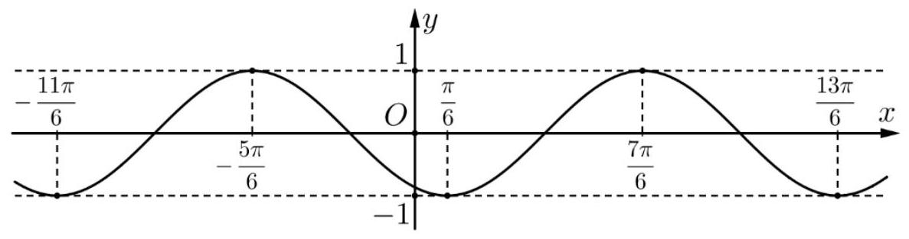
A. $T=\frac{\pi}{6}$.
B. $T=\pi$.
C. $T=2 \pi$.
D. $T=4 \pi$.

## Lời giải. Chọn C.

Câu 48. Cho hàm số $y=f x$ có đồ thị như hình vẽ. Chu kỳ $T$ của hàm số là
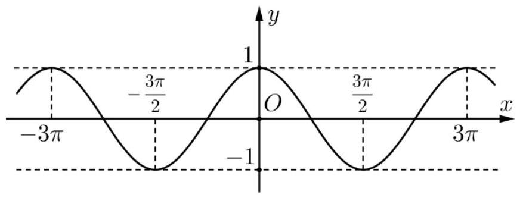
A. $T=\frac{3 \pi}{2}$.
B. $T=2 \pi$.
C. $T=3 \pi$.
D. $T=6 \pi$.

## Lời giải. Chọn C.

Câu 49. Cho hàm số $y=f x$ có đồ thị như hình vẽ. Chu kỳ $T$ của hàm số là
A. $T=\frac{\pi}{4}$.
B. $T=\frac{\pi}{2}$.
C. $T=\pi$.
D. $T=2 \pi$.
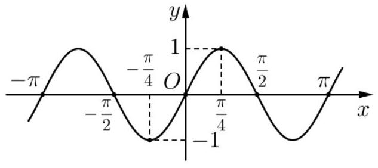

## Lời giải. Chọn C.

Câu 50*. Cho các hàm số $y=\sin x, y=x+\sin x, y=x \cos x$ và $y=\frac{\sin x}{x}$. Trong các hàm số đã cho có bao nhiêu hàm số có tính tuần hoàn?
A. 1 .
B. 2 .
C. 3 .
D. 4 .

Lời giải. Chọn A. Các hàm số $y=x+\sin x, y=x \cos x, y=\frac{\sin x}{x}$ không tuần hoàn.
Xét hàm số $y=x+\sin x$.

- Tập xác định $\mathrm{D}=\mathbb{R}$.
- Giả sử $f x+T=f x, \forall x \in \mathbf{D}$

$$
\begin{aligned}
& \Leftrightarrow x+T+\sin x+T=x+\sin x, \forall x \in \mathrm{D} \\
& \Leftrightarrow T+\sin x+T=\sin x, \forall x \in \mathrm{D} .
\end{aligned}
$$

Cho $x=0$ và $x=\pi$, ta được $\left\{\begin{array}{l}T+\sin T=\sin 0=0 \\ T+\sin \pi+T=\sin \pi=0\end{array}\right.$.
Suy ra $2 T+\sin T+\sin \pi+T=0 \Leftrightarrow T=0$. Điều này trái với định nghĩa là $T>0$.
Vậy hàm số $y=x+\sin x$ không phải là hàm số tuần hoàn.
Tương tự chứng minh cho các hàm số $y=x \cos x$ và $y=\frac{\sin x}{x}$ không tuần hoàn.

## Dang 4. SƯ DÔNG BIẾN - NGHICH BIẾN CUAA HÀM SÓ

Câu 51. Cho hàm số $y=\sin x$. Mệnh đề nào sau đây đúng?
A. Hàm số đồng biến trên khoảng $\left(\frac{\pi}{2} ; \pi\right)$, nghịch biến trên khoảng $\left(\pi ; \frac{3 \pi}{2}\right)$.
B. Hàm số đồng biến trên khoảng $\left(-\frac{3 \pi}{2} ;-\frac{\pi}{2}\right)$, nghịch biến trên khoảng $\left(-\frac{\pi}{2} ; \frac{\pi}{2}\right)$.
C. Hàm số đồng biến trên khoảng $\left(0 ; \frac{\pi}{2}\right)$, nghịch biến trên khoảng $\left(-\frac{\pi}{2} ; 0\right)$.
D. Hàm số đồng biến trên khoảng $\left(-\frac{\pi}{2} ; \frac{\pi}{2}\right)$, nghịch biến trên khoảng $\left(\frac{\pi}{2} ; \frac{3 \pi}{2}\right)$.

Ôn tập kiến thức toán 10-11-12
Luyện thi THPTQG và ĐGNL

fb.me/loptoancachep 0948.215.040 (thầy Huy)

Lời giải. Dựa vào lý thuyết " Hàm số $y=\sin x$ đồng biến khi $x$ thuộc góc phần tư thứ I và thứ IV; nghịch biến khi $x$ thuộc góc phần tư thứ II và thứ III ". Chọn D.

Câu 52. Hàm số nào sau đây có tính đơn điệu trên khoảng ( $0 ; \frac{\pi}{2}$ ) khác với các hàm số còn lại?
A. $y=\sin x$.
B. $y=\cos x$.
C. $y=\tan x$.
D. $y=-\cot x$.

Lời giải. Chọn B. Trên khoảng ( $0 ; \frac{\pi}{2}$ ) thì

- $y=\cos x$ nghịch biến.
- Các hàm số $y=\sin x, y=\tan x, y=-\cot x$ đồng biến.

Câu 53. Với $x \in\left(\frac{31 \pi}{4} ; \frac{33 \pi}{4}\right)$, mệnh đề nào sau đây đúng?
A. Hàm số $y=\sin x$ đồng biến.
B. Hàm số $y=\cos x$ nghịch biến.
C. Hàm số $y=\cot x$ nghịch biến.
D. Hàm số $y=\tan x$ nghịch biến.

Lời giải. Ta có $\left(\frac{31 \pi}{4} ; \frac{33 \pi}{4}\right)=\left(-\frac{\pi}{4}+8 \pi ; \frac{\pi}{4}+8 \pi\right)$ thuộc góc phần tư thứ I và IV. Chọn $\mathbf{A}$.

Câu 54. Hàm số nào sau đây đồng biến trên nửa khoảng $\left(\frac{\pi}{4} ; \frac{\pi}{2}\right]$ ?
A. $y=\tan x$.
B. $y=\cot x$.
C. $y=\sin 2 x$.
D. $y=\cos 4 x$.

Lời giải. Tại $x=\frac{\pi}{2}$ hàm $y=\tan x$ không xác định. Loại A.
Hàm $y=\cot x$ nghịch biến trên từng khoảng xác định. Loại B.
Với $x \in\left(\frac{\pi}{4} ; \frac{\pi}{2}\right] \rightarrow 2 x \in\left(\frac{\pi}{2} ; \pi\right]$ : góc phần tư thứ II nên hàm sin giảm. Loại C.
Với $x \in\left[\frac{\pi}{4} ; \frac{\pi}{2}\right] \rightarrow 4 x \in \pi ; 2 \pi$ : góc phần tư thứ III và IV nên hàm $\cos$ tăng. Chọn D.

Câu 55. Trong các hàm số sau, có bao nhiêu hàm số đồng biến trên $\left(-\frac{\pi}{3} ; \frac{\pi}{6}\right)$ ?

$$
y=\sin \left(2 x+\frac{\pi}{6}\right), y=\cos \left(2 x+\frac{\pi}{6}\right), y=\tan \left(2 x+\frac{\pi}{6}\right) \text { và } y=\cot \left(2 x+\frac{\pi}{6}\right)
$$

A. 1 .
B. 2 .
C. 3 .
D. 4 .

Lời giải. Với $x \in\left(-\frac{\pi}{3} ; \frac{\pi}{6}\right) \rightarrow 2 x \in\left(-\frac{2 \pi}{3} ; \frac{\pi}{3}\right) \rightarrow 2 x+\frac{\pi}{6} \in\left(-\frac{\pi}{2} ; \frac{\pi}{2}\right)$ thuộc góc phần tư thứ I và thứ IV nên các hàm số $y=\sin \left(2 x+\frac{\pi}{6}\right)$ và $y=\tan \left(2 x+\frac{\pi}{6}\right)$ đồng biến. Chọn B.

Câu 56. Để hàm số $y=\sin \left(x+\frac{\pi}{4}\right)$ đồng biến, ta chọn $x$ thuộc khoảng nào sau đây?
A. $\left(-\frac{\pi}{2}+k 2 \pi ; \frac{\pi}{2}+k 2 \pi\right)$.
B. $\pi+k 2 \pi ; 2 \pi+k 2 \pi$.
C. $\left(-\frac{3 \pi}{4}+k \pi ; \frac{\pi}{4}+k \pi\right)$.
D. $\left(-\frac{3 \pi}{4}+k 2 \pi ; \frac{\pi}{4}+k 2 \pi\right)$.

Lời giải. Chọn D. Hàm $y=\sin x$ đồng biến khi $x$ thuộc góc phần tư thứ I và thứ IV.
Do đó để hàm số $y=\sin \left(x+\frac{\pi}{4}\right)$ đồng biến khi $x+\frac{\pi}{4} \in\left(-\frac{\pi}{2}+k 2 \pi ; \frac{\pi}{2}+k 2 \pi\right)$

$$
\Leftrightarrow x \in\left(-\frac{3 \pi}{4}+k 2 \pi ; \frac{\pi}{4}+k 2 \pi\right) \text { với } k \in \mathbb{Z} \text {. }
$$

Câu 57. Trong khoảng $\left(0 ; \frac{\pi}{2}\right)$, hàm số $y=\sin x-\cos x$ là
A. hàm số đồng biến.
B. hàm số nghịch biến.
C. hàm hằng.
D. hàm số không đơn điệu.

Lời giải. Ta có $y=\sin x-\cos x=\sqrt{2} \sin \left(x-\frac{\pi}{4}\right)$. Vì $x \in\left(0 ; \frac{\pi}{2}\right) \rightarrow x-\frac{\pi}{4} \in\left(-\frac{\pi}{4} ; \frac{\pi}{4}\right)$ thuộc góc phần tứ thứ I và thứ IV nên hàm số đã cho đồng biến. Chọn $\mathbf{A}$.

Cách 2. Ta thấy trên khoảng ( $0 ; \frac{\pi}{2}$ ), hàm $y=\sin x$ đồng biến và hàm $y=-\cos x$ đồng biến. Do đó hàm $y=\sin x+-\cos x$ đồng biến.

Câu 58. Cho hàm số $y=4 \sin \left(x+\frac{\pi}{6}\right) \cos \left(x-\frac{\pi}{6}\right)-\sin 2 x$. Mệnh đề nào sau đây đúng?
A. Hàm số đã cho đồng biến trên các khoảng $\left(0 ; \frac{\pi}{4}\right)$ và $\left(\frac{3 \pi}{4} ; \pi\right)$.
B. Hàm số đã cho đồng biến trên $0 ; \pi$.
C. Hàm số đã cho nghịch biến trên $\left(0 ; \frac{3 \pi}{4}\right)$.
D. Hàm số đã cho đồng biến trên ( $0 ; \frac{\pi}{4}$ ) và nghịch biến trên ( $\frac{\pi}{4} ; \pi$ ).

Lời giải. Có $y=4 \sin \left(x+\frac{\pi}{6}\right) \cos \left(x-\frac{\pi}{6}\right)-\sin 2 x=2\left(\sin 2 x+\sin \frac{\pi}{3}\right)-\sin 2 x=\sqrt{3}+\sin 2 x$.
Xét mệnh đề A: Với $x \in\left(0 ; \frac{\pi}{4}\right) \rightarrow 2 x \in\left(0 ; \frac{\pi}{2}\right)$ : góc phần tư thứ I;

$$
x \in\left(\frac{3 \pi}{4} ; \pi\right) \rightarrow 2 x \in\left(\frac{3 \pi}{2} ; 2 \pi\right) \text { : góc phần tư thứ IV. }
$$

Ở góc phần tư thứ I và thứ IV hàm số sin đồng biến. Vậy đáp án $A$ đúng. Chọn $A$.

Câu 59. Hàm số nào trong bốn hàm số được cho ở các đáp án $\mathrm{A}, \mathrm{B}, \mathrm{C}, \mathrm{D}$ có bảng biến thiên trên khoảng $\left(-\frac{\pi}{2} ; \frac{\pi}{2}\right)$ như sau:
A. $y=\sin x$.
B. $y=\cos x$.
C. $y=\tan x$.
D. $y=\cot x$.

| $x$ | $-\frac{\pi}{2}$ | 0 |  | $\frac{\pi}{2}$ |
| :--- | :--- | :--- | :---: | ---: |
| $y$ | 0 |  |  |  |

Lời giải. Dựa vào bảng biến thiên ta thấy hàm số nghịch biến trên từng khoảng xác định. Đối chiếu các đáp án chỉ có đáp án D thỏa mãn. Chọn D.

Câu 60. Với mọi $x \in\left(0 ; \frac{\pi}{2}\right)$, so sánh $\cos \sin x$ với $\cos 1$ thì
A. $\cos \sin x>\cos 1$.
B. $\cos \sin x \geq \cos 1$.
C. không so sánh được.
D. $\cos \sin x<\cos 1$.

Lời giải. Vì $x \in\left(0 ; \frac{\pi}{2}\right)$ nên $0<\sin x<1$.

Hàm số $y=\cos x$ nghịch biến trên $\left(0 ; \frac{\pi}{2}\right)$, suy ra $y=\cos x$ nghịch biến trên $0 ; 1$.
Do đó, $\cos \sin x>\cos 1$. Chọn A.

## Dång 5. NHÂN DANG ĐÔ THI CƯA HÀM SỐ

Câu 61. Hàm số nào trong bốn hàm số được cho ở các đáp án $\mathrm{A}, \mathrm{B}, \mathrm{C}, \mathrm{D}$ có đồ thị như hình vẽ dưới đây?
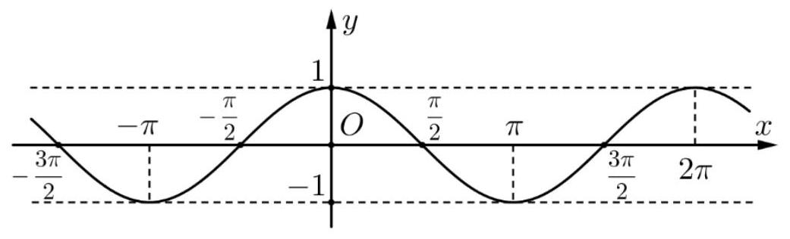
A. $y=1+\sin 2 x$.
B. $y=\cos x$.
C. $y=-\sin x$.
D. $y=-\cos x$.

Lời giải. Ta thấy tại $x=0$ thì $y=1$. Do đó loại đáp án C và D .

Tại $x=\frac{\pi}{2}$ thì $y=0$. Do đó chỉ có đáp án B thỏa mãn. Chọn B.

Câu 62. Hàm số nào trong bốn hàm số được cho ở các đáp án $A, B, C, D$ có đồ thị như hình vẽ dưới đây?
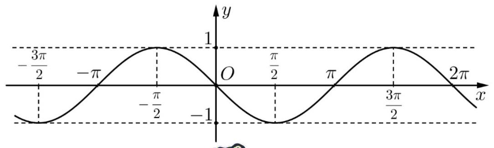
fb.me/loptoancachep 0948.215 .040 (thầy Huy)
A. $y=\sin x$.
B. $y=|\sin x|$.
C. $y=\sin |x|$.
D. $y=-\sin x$.

Lời giải. Ta thấy tại $x=0$ thì $y=0$. Cả 4 đáp án đều thỏa.

Tại $x=\frac{\pi}{2}$ thì $y=-1$. Do đó chỉ có đáp án D thỏa mãn. Chọn D.

Câu 63. Hàm số nào trong bốn hàm số được cho ở các đáp án $A, B, C, D$ có đồ thị như hình vẽ dưới đây?
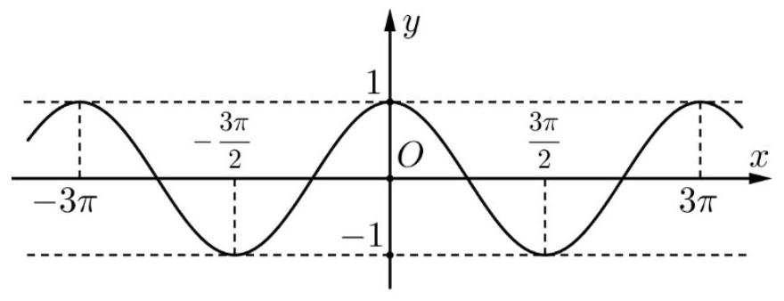
A. $y=\cos \frac{2 x}{3}$.
B. $y=\sin \frac{2 x}{3}$.
C. $y=\cos \frac{3 x}{2}$.
D. $y=\sin \frac{3 x}{2}$.

Lời giải. Ta thấy tại $x=0$ thì $y=1$. Do đó ta loại đáp án B và D .
Tại $x=3 \pi$ thì $y=1$. Thay vào hai đáp án A và C thì chỉ có A thỏa mãn. Chọn $\mathbf{A}$.

Câu 64. Hàm số nào trong bốn hàm số được cho ở các đáp án $A, B, C, D$ có đồ thị như hình vẽ dưới đây?
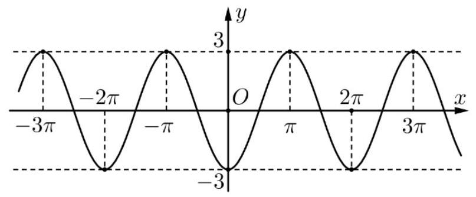
A. $y=\cos x-4$.
B. $y=-2-\cos x$.
C. $y=-3 \cos x$.
D. $y=2+|\cos x|$.

Lời giải. Ta thấy tại $x=0$ thì $y=-3$. Do đó ta loại đáp án D.
Tại $x=\pi$ thì $y=3$. Thay vào chỉ có đáp án C thỏa mãn. Chọn C.

Câu 65. Hàm số nào trong bốn hàm số được cho ở các đáp án $A, B, C, D$ có đồ thị như hình vẽ dưới đây?
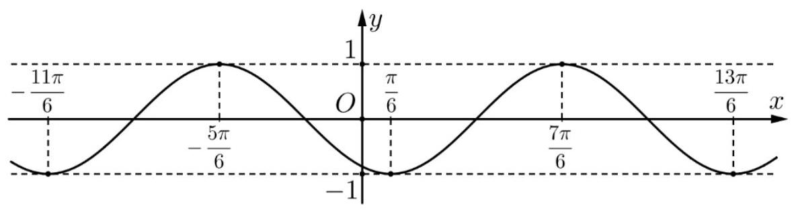
A. $y=\sin \left(x+\frac{\pi}{3}\right)$.
B. $y=-\sin \left(x+\frac{\pi}{3}\right)$.
C. $y=\sin \left|x+\frac{\pi}{3}\right|$.
D. $y=\left|\sin \left(x+\frac{\pi}{3}\right)\right|$.

Lời giải. Ta thấy $x=\frac{\pi}{6}$ thì $y=-1$. Do đó chỉ có đáp án B thỏa mãn. Chọn B.

Câu 66. Hàm số nào trong bốn hàm số được cho ở các đáp án $\mathrm{A}, \mathrm{B}, \mathrm{C}, \mathrm{D}$ có đồ thị như hình vẽ dưới đây?
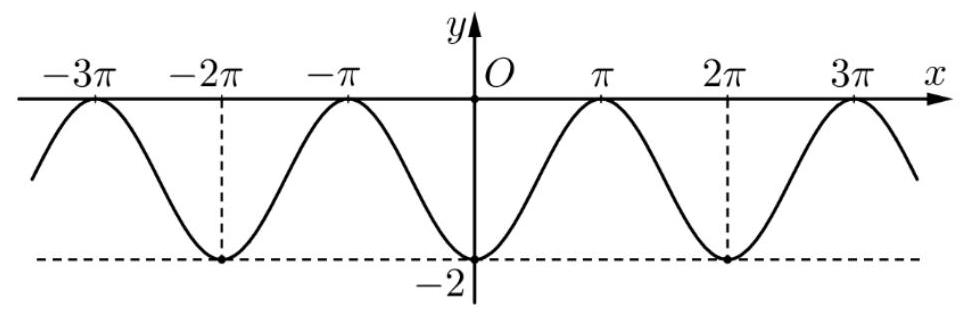
A. $y=\sin \left(x-\frac{\pi}{2}\right)-1$.
B. $y=2 \sin \left(x-\frac{\pi}{2}\right)$.
C. $y=-\sin \left(x-\frac{\pi}{2}\right)-1$.
D. $y=\sin \left(x+\frac{\pi}{2}\right)+1$.

Lời giải. Dựa vào đồ thị ta thấy hàm số có GTLN bằng $0, \mathrm{GTNN}$ bằng -2 . Do đó ta loại đáp án B.

Tại $x=0$ thì $y=-2$. Thử vào các đáp án còn lại chỉ có A thỏa mãn. Chọn A.

Câu 67*. Hàm số nào trong bốn hàm số được cho ở các đáp án $A, B, C, D$ có đồ thị như hình vẽ dưới đây?

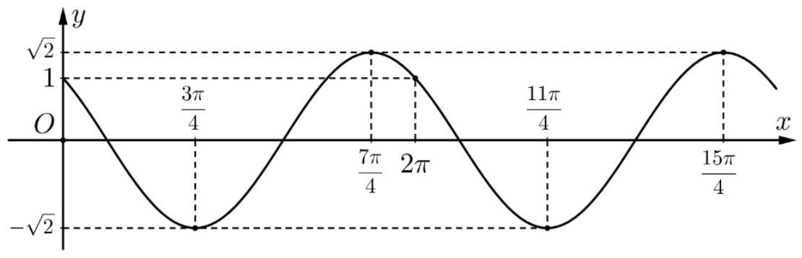
A. $y=\sin \left(x-\frac{\pi}{4}\right)$.
B. $y=\cos \left(x-\frac{\pi}{4}\right)$.
C. $y=\sqrt{2} \sin \left(x+\frac{\pi}{4}\right)$.
D. $y=\sqrt{2} \cos \left(x+\frac{\pi}{4}\right)$.

Lời giải. Dựa vào đồ thị ta thấy hàm số có GTLN bằng $\sqrt{2}$ và GTNN bằng $-\sqrt{2}$. Do đó các đáp án A và B không thỏa mãn.

Tại $x=\frac{3 \pi}{4}$ thì $y=-\sqrt{2}$. Thay vào hai đáp án C và D thỉ chỉ có D thỏa mãn. Chọn D.

Câu 68. Hàm số nào trong bốn hàm số được cho ở các đáp án $\mathrm{A}, \mathrm{B}, \mathrm{C}, \mathrm{D}$ có đồ thị như hình vẽ dưới đây?
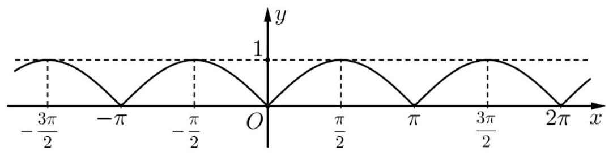
A. $y=|\sin x|$.
B. $y=\sin |x|$.
C. $y=\cos |x|$.
D. $y=|\cos x|$.

Lời giải. Dựa vào đồ thị ta thấy hàm số có GTNN bằng 0 . Do đó chỉ có A hoặc D thỏa.
Tại $x=0$ thì $y=0$. Thay vào hai đáp án còn lại chỉ có A thỏa mãn. Chọn A.

Câu 69. Hàm số nào trong bốn hàm số được cho ở các đáp án $A, B, C, D$ có đồ thị như hình vẽ dưới đây?

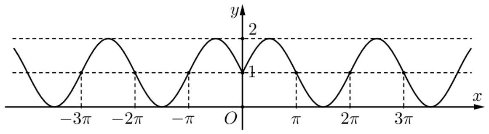
A. $y=1+\sin |x|$.
B. $y=|\sin x|$.
C. $y=1+|\cos x|$.
D. $y=1+|\sin x|$.

Lời giải. Dựa vào đồ thị ta thấy hàm số có GTNN bằng 0 . Mà $y=1+|\cos x| \geq 1$ và $y=1+|\sin x| \geq 1$ nên loại các đáp án C và D .

Ta thấy tại $x=0$ thì $y=1$. Thay vào hai đáp án A và B thì chỉ có A thỏa. Chọn A .

Câu 70. Hàm số nào trong bốn hàm số được cho ở các đáp án $A, B, C, D$ có đồ thị như hình vẽ dưới đây?
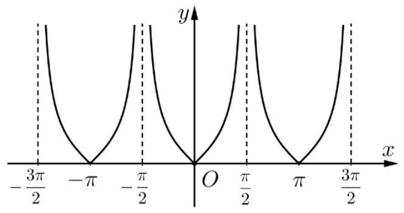
A. $y=\tan x$.
B. $y=\cot x$.
C. $y=|\tan x|$.
D. $y=|\cot x|$.

Lời giải. Dựa vào đồ thị ta thấy hàm số có GTNN bằng 0 . Do đó loại đáp án $A$ và $B$.
Hàm số xác định tại $x=0$ và tại $x=0$ thì $y=0$. Do đó chỉ có C thỏa mãn. Chọn C.

## Dang 6. GIÁ TRI LớN NHÁT - GIÁ TRI NHỎ NHÁT

Câu 71. Tìm giá trị lớn nhất $M$ và giá trị nhỏ nhất $m$ của hàm số $y=3 \sin x-2$.
A. $M=1, m=-5$.
B. $M=-3, m=-1$.
C. $M=2, m=-2$.
D. $M=0, m=-2$.

Lời giải. Ta có $-1 \leq \sin x \leq 1 \longrightarrow-3 \leq 3 \sin x \leq 3 \longrightarrow-5 \leq 3 \sin x-2 \leq 1$.
Vậy $-5 \leq y \leq 1 \longrightarrow\left\{\begin{array}{l}M=1 \\ m=-5\end{array}\right.$. Chọn A.

Câu 72. Tìm tập giá trị $T$ của hàm số $y=3 \cos 2 x+5$.
A. $T=-1 ; 1$.
B. $T=-1 ; 11$.
C. $T=2 ; 8$.
D. $T=5 ; 8$.

Lời giải. Ta có $-1 \leq \cos 2 x \leq 1 \longrightarrow-3 \leq 3 \cos 2 x \leq 3 \longrightarrow 2 \leq 3 \cos 2 x+5 \leq 8$.
Vậy $2 \leq y \leq 8 \longrightarrow T=2 ; 8$. Chọn C.

Câu 73. Tìm tập giá trị $T$ của hàm số $y=5-3 \sin x$.
A. $T=-1 ; 1$.
B. $T=-3 ; 3$.
C. $T=2 ; 8$.
D. $T=5 ; 8$.

Lời giải. Ta có $-1 \leq \sin x \leq 1 \longrightarrow 1 \geq-\sin x \geq-1 \longrightarrow 3 \geq-3 \sin x \geq-3$
$\longrightarrow 8 \geq 5-3 \sin x \geq 2$. Vậy $2<y<8 \longrightarrow T=2 ; 8$. Chọn C.

Câu 74. Tìm giá trị nhỏ nhất $m$ của hàm số $y=-\sqrt{2} \sin \left(2021 x+\frac{\pi}{3}\right)$.
A. $m=-2017 \sqrt{2}$.
B. $m=-2016 \sqrt{2}$.
C. $m=-\sqrt{2}$.
D. $m=-1$.

Lời giải. Ta có $-1 \leq \sin \left(2021 x+\frac{\pi}{3}\right) \leq 1 \longrightarrow \sqrt{2} \geq-\sqrt{2} \sin \left(2021 x+\frac{\pi}{3}\right) \geq-\sqrt{2}$.
Vậy giá trị nhỏ nhất của hàm số là $-\sqrt{2}$. Chọn C.

Câu 75. Hàm số $y=\cos |3 x-5|$ có giá trị nhỏ nhất bằng
A. 0 .
B. -1 .
C. 1 .
D. -2 .

Lời giải. Ta có $-1 \leq \cos |3 x-5| \leq 1, \forall x \in \mathbb{R}$.
Do đó $\min _{\mathbb{R}} y=-1$, đạt được khi $|3 x-5|=\pi+k 2 \pi \Leftrightarrow\left[\begin{array}{l}x=\frac{\pi+5}{3}+k \frac{2 \pi}{3} \\ x=\frac{5-\pi}{3}-k \frac{2 \pi}{3}\end{array} \quad k \in \mathbb{Z}\right.$. Chọn B.

Câu 76. Tìm giá trị lớn nhất $M$ và giá trị nhỏ nhất $m$ của hàm số $y=1-2|\cos 3 x|$.

A. $M=3, m=-1$.
B. $M=1, m=-1$.
C. $M=2, m=-2$.
D. $M=0, m=-2$.

Lời giải. Ta có $-1 \leq \cos 3 x \leq 1 \longrightarrow 0 \leq|\cos 3 x| \leq 1 \longrightarrow 0 \geq-2|\cos 3 x| \geq-2$
$\longrightarrow 1 \geq 1-2|\cos 3 x| \geq-1$. Vậy $1 \geq y \geq-1 \longrightarrow\left\{\begin{array}{l}M=1 \\ m=-1\end{array}\right.$. Chọn B.

Câu 77. Khi $x$ thay đổi trong đoạn $\left[-\frac{\pi}{2} ; \pi\right]$ thì $y=\sin x$ lấy mọi giá trị thuộc
A. đoạn $-1 ; 0$.
B. khoảng $-1 ; 0$.
C. nửa khoảng $-1 ; 1$.
D. đoạn $-1 ; 1$.

Lời giải. Dựa vào đường tròn lượng giác, dễ dàng xác định được $\sin x \in-1 ; 1$ khi $x \in\left[-\frac{\pi}{2} ; \pi\right]$. Chọn
D.

Sai lầm học sinh hay gặp là lấy giá trị sin của hai đầu mút, cụ thể $\sin \left(-\frac{\pi}{2}\right)=-1$ và $\sin \pi=0$ và chọn
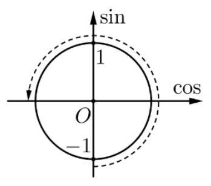
A.

Câu 78. Khi $x$ thay đổi trong nửa khoảng $\left(-\frac{\pi}{3} ; \frac{\pi}{6}\right)$ thì $y=\cos 2 x$ lấy mọi giá trị thuộc
A. $\left(-\frac{1}{2} ; \frac{1}{2}\right)$.
B. $\left(\frac{1}{2} ; \frac{\sqrt{3}}{2}\right]$.
C. $\left(-\frac{1}{2} ; 1\right]$.
D. $\left(-\frac{\sqrt{3}}{2} ; \frac{\sqrt{3}}{2}\right]$.

Lời giải. Với $x \in\left(-\frac{\pi}{3} ; \frac{\pi}{6}\right] \rightarrow 2 x \in\left(-\frac{2 \pi}{3} ; \frac{\pi}{3}\right]$. Dựa vào đường tròn lượng giác, dễ dàng xác định được $y=\cos 2 x$ nhận mọi giá trị từ $-\frac{1}{2}$ đến 1 (không lấy giá trị $-\frac{1}{2}$ ). Chọn C.
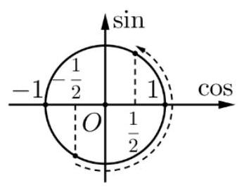

Cách 2. Ta có thể lập bảng giá trị như sau:

| $x$ | $-\frac{\pi}{3} \quad-\frac{\pi}{4}$ | $-\frac{\pi}{6}$ | $-\frac{\pi}{12}$ | $-\frac{\pi}{12}$ | $\frac{\pi}{6}$ |
| :--- | :--- | :--- | :--- | :--- | :--- |
| $2 x$ | $-\frac{2 \pi}{3} \quad-\frac{\pi}{2}$ | $-\frac{\pi}{3}$ | $-\frac{\pi}{6}$ | $\frac{\pi}{6}$ | $\frac{\pi}{3}$ |
| $\cos 2 x$ |  |  |  |  | $-\frac{1}{2} \longrightarrow 0 \longrightarrow \frac{1}{2} \longrightarrow \frac{\sqrt{3}}{2} \longrightarrow \frac{\sqrt{3}}{2} \longrightarrow \frac{1}{2}$ |

Câu 79. Khi $x$ thay đổi trong đoạn $\left[-\frac{\pi}{4} ; \frac{\pi}{6}\right]$ thì $y=\sin ^{2} 2 x$ lấy mọi giá trị thuộc
A. $\left[\frac{1}{4} ; \frac{1}{2}\right]$.
B. $\left[0 ; \frac{1}{2}\right]$.
C. $\left[\frac{3}{4} ; 1\right]$.
D. $0 ; 1$.

Lời giải. Với $x \in\left[-\frac{\pi}{4} ; \frac{\pi}{6}\right] \rightarrow 2 x \in\left[-\frac{\pi}{2} ; \frac{\pi}{3}\right]$.
Dựa vào đường tròn lượng giác, dễ dàng xác định được $y=\sin 2 x$ nhận mọi giá trị từ -1 đến $\frac{\sqrt{3}}{2}$.

Ta có $-1 \leq \sin 2 x \leq \frac{\sqrt{3}}{2} \longrightarrow 0 \leq \sin ^{2} 2 x \leq 1$. Chọn
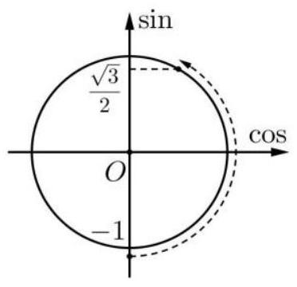
D.

Câu 80. Hàm số $y=3-5 \sin x^{2022}$ có giá trị lớn nhất là $M$ và giá trị nhỏ nhất là $m$. Giá trị của $M+m$ bằng
A. $2^{2022}$.
B. $2^{4044}$.
C. $2^{2022} 1+2^{4044}$.
D. $2^{6066}$.

Lời giải. Ta có $-1 \leq \sin x \leq 1 \longrightarrow 5 \geq-5 \sin x \geq-5$ hay $-5 \leq-5 \sin x \leq 5$
$\longrightarrow-2 \leq 3-5 \sin x \leq 8 \longrightarrow \leq 0 \leq 3-5 \sin x^{2022} \leq 8^{2022}$.
Vậy $m=0$ và $M=8^{2022}=2^{6066}$. Chọn D.

Câu 81. Giá trị nhỏ nhất và lớn nhất của hàm số $f x=\sin \left(\frac{\pi}{3}|\sin x|\right)$ lần lượt là
A. -1 và 1 .
B. 0 và 1 .
C. $-\frac{\sqrt{3}}{2}$ và $\frac{\sqrt{3}}{2}$.
D. 0 và $\frac{\sqrt{3}}{2}$.

Lời giải. Vì $0 \leq|\sin x| \leq 1 \longrightarrow 0 \leq \frac{\pi}{3}|\sin x| \leq \frac{\pi}{3}$. Trên đoạn $\left[0 ; \frac{\pi}{3}\right]$ hàm số sin luôn tăng nên $\sin 0 \leq \sin \left(\frac{\pi}{3}|\sin x|\right) \leq \sin \frac{\pi}{3}$ hay $0 \leq \sin \left(\frac{\pi}{3}|\sin x|\right) \leq \frac{\sqrt{3}}{2}$. Chọn D.

Câu 82. Tìm giá trị nhỏ nhất $m$ của hàm số $y=\frac{1}{\cos x+1}$.
A. $m=\frac{1}{2}$.
B. $m=\frac{1}{\sqrt{2}}$.
C. $m=1$.
D. $m=\sqrt{2}$.

Lời giải. Ta có $\frac{1}{\cos x+1}$ nhỏ nhất khi và chỉ khi $\cos x+1$ lớn nhất $\Leftrightarrow \cos x$ lớn nhất $\Leftrightarrow \cos x=1$.
Khi đó $y_{\text {min }}=\frac{1}{\cos x+1}=\frac{1}{2}$. Chọn A.

Câu 83. Giá trị nhỏ nhất và lớn nhất của hàm số $f x=1+2 \sqrt{4+\cos 3 x}$ lần lượt là
A. $1+2 \sqrt{3} ; 1+2 \sqrt{5}$.
B. $2 \sqrt{3} ; 2 \sqrt{5}$.
C. $1-2 \sqrt{3} ; 1+2 \sqrt{5}$.
D. $-1+2 \sqrt{3} ;-1+2 \sqrt{5}$.

Lời giải. Chọn A. Ta có $-1 \leq \cos 3 x \leq 1, \forall x \in \mathbb{R}$

$$
\begin{aligned}
& \Leftrightarrow 3 \leq 4+\cos 3 x \leq 5 \\
& \Leftrightarrow \sqrt{3} \leq \sqrt{4+\cos 3 x} \leq \sqrt{5} \\
& \Leftrightarrow 1+2 \sqrt{3} \leq 1+2 \sqrt{4+\cos 3 x} \leq 1+2 \sqrt{5} .
\end{aligned}
$$

Do đó

- $\max _{\mathbb{R}} y=1+2 \sqrt{5}$, đạt được khi $\cos 3 x=1 \Leftrightarrow 3 x=k 2 \pi \Leftrightarrow x=k \frac{2 \pi}{3} \quad k \in \mathbb{Z}$.
- $\min _{\mathbb{R}} y=1+2 \sqrt{3}$, đạt được khi $\cos 3 x=-1 \Leftrightarrow 3 x=\pi+k 2 \pi \Leftrightarrow x=\frac{\pi}{3}+k \frac{2 \pi}{3} \quad k \in \mathbb{Z}$.

Câu 84. Hàm số $y=5+4 \sin 2 x \cos 2 x$ có tất cả bao nhiêu giá trị nguyên?
A. 3 .
B. 4 .
C. 5 .
D. 6 .

Lời giải. Viết lại $y=5+4 \sin 2 x \cos 2 x=5+2 \sin 4 x$.
Mà $-1 \leq \sin 4 x \leq 1 \longrightarrow-2 \leq 2 \sin 4 x \leq 2 \longrightarrow 3 \leq 5+2 \sin 4 x \leq 7$.
Vậy $3 \leq y \leq 7 \xrightarrow{y \in \mathbb{Z}} y \in 3 ; 4 ; 5 ; 6 ; 7$ nên $y$ có 5 giá trị nguyên. Chọn $\mathbf{C}$.

Câu 85. Tập giá trị của hàm số $y=\sin 2021 x-\cos 2021 x$ là
A. $-1 ; 1$.
B. $-4042 ; 4042$.
C. $[-\sqrt{2} ; \sqrt{2}]$.
D. $[0 ; \sqrt{2}]$.

Lời giải. Ta có $y=\sin 2021 x-\cos 2021 x=\sqrt{2} \sin \left(2021 x-\frac{\pi}{4}\right) \Rightarrow-\sqrt{2} \leq y \leq \sqrt{2}$. Chọn C.

Câu 86. Hàm số $y=\sin ^{4} x-\cos ^{4} x$ đạt giá trị nhỏ nhất tại $x=x_{0}$. Mệnh đề nào sau đây đúng?
A. $x_{0}=\frac{\pi}{4}+k \pi, k \in \mathbb{Z}$.
B. $x_{0}=\frac{\pi}{4}+k 2 \pi, k \in \mathbb{Z}$.
C. $x_{0}=k \pi, k \in \mathbb{Z}$.
D. $x_{0}=\frac{\pi}{2}+k \pi, k \in \mathbb{Z}$.

Lời giải. Ta có $y=\sin ^{4} x-\cos ^{4} x=\sin ^{2} x+\cos ^{2} x \quad \sin ^{2} x-\cos ^{2} x=-\cos 2 x$.

Mà $-1 \leq \cos 2 x \leq 1 \longrightarrow-1 \geq-\cos 2 x \geq 1$. Do đó giá trị nhỏ nhất của hàm số là -1 .
Đẳng thức xảy ra $\Leftrightarrow \cos 2 x=1 \Leftrightarrow 2 x=k 2 \pi \Leftrightarrow x=k \pi \quad k \in \mathbb{Z}$. Chọn C.

Câu 87. Cho hàm số $y=\cos ^{4} x+\sin ^{4} x$. Mệnh đề nào sau đây đúng?
A. $y \leq 2, \forall x \in \mathbb{R}$.
B. $y \leq \sqrt{2}, \forall x \in \mathbb{R}$.
C. $y \leq 1, \forall x \in \mathbb{R}$.
D. $y \leq \frac{1}{2}, \forall x \in \mathbb{R}$.

Lời giải. Ta có $y=\cos ^{4} x+\sin ^{4} x=\sin ^{2} x+\cos ^{2} x{ }^{2}-2 \sin ^{2} x \cos ^{2} x$

$$
=1-\frac{1}{2} \sin ^{2} 2 x=1-\frac{1}{2} \cdot \frac{1-\cos 4 x}{2}=\frac{3}{4}+\frac{1}{4} \cos 4 x
$$

Mà $-1 \leq \cos 4 x \leq 1 \longrightarrow \frac{1}{2} \leq \frac{3}{4}+\frac{1}{4} \cos 4 x \leq 1$. Vậy $\frac{1}{2} \leq y \leq 1$. Chọn C.
Ôn tập kiến thức toán 10-11-12
Luyện thi THPTQG và ĐGNL

Nhận xét: Từ $y=\cos ^{4} x+\sin ^{4} x=1-\frac{1}{2} \sin ^{2} 2 x$, ta có thể đánh giá thông qua $\sin ^{2} 2 x$.

Câu 88. Tập giá trị của hàm số $y=\sin ^{6} x+\cos ^{6} x$ là
A. $0 ; 2$.
B. $\left[\frac{1}{2} ; 1\right]$.
C. $\left[\frac{1}{4} ; 1\right]$.
D. $\left[0 ; \frac{1}{4}\right]$.

Lời giải. Ta có $y=\sin ^{6} x+\cos ^{6} x=\sin ^{2} x+\cos ^{2} x{ }^{2}-3 \sin ^{2} x \cos ^{2} x \sin ^{2} x+\cos ^{2} x$

$$
=1-3 \sin ^{2} x \cos ^{2} x=1-\frac{3}{4} \sin ^{2} 2 x=1-\frac{3}{4} \cdot \frac{1-\cos 4 x}{2}=\frac{5}{8}+\frac{3}{8} \cos 4 x .
$$

Mà $-1 \leq \cos 4 x \leq 1 \longrightarrow \frac{1}{4} \leq \frac{5}{8}+\frac{3}{8} \cos 4 x \leq 1$. Vậy $\frac{1}{4} \leq y \leq 1$. Chọn C.
Nhận xét: Từ $y=\sin ^{6} x+\cos ^{6} x=1-\frac{3}{4} \sin ^{2} 2 x$, ta có thể đánh giá thông qua $\sin ^{2} 2 x$.

Câu 89. Hàm số $y=\sin \left(x+\frac{\pi}{3}\right)-\sin x$ có tất cả bao nhiêu giá trị nguyên?
A. 1 .
B. 2 .
C. 3 .
D. 4 .

Lời giải. Áp dụng công thức: $\sin a-\sin b=2 \cos \frac{a+b}{2} \sin \frac{a-b}{2}$, ta có

$$
\sin \left(x+\frac{\pi}{3}\right)-\sin x=2 \cos \left(x+\frac{\pi}{6}\right) \sin \frac{\pi}{6}=\cos \left(x+\frac{\pi}{6}\right)
$$

Ta có $-1 \leq \cos \left(x+\frac{\pi}{6}\right) \leq 1$ nên $-1 \leq y \leq 1 \xrightarrow{y \in \mathbb{Z}} y \in-1 ; 0 ; 1$. Chọn C.

Câu 90. Tìm giá trị lớn nhất $M$ của hàm số $y=\frac{2}{1+\tan ^{2} x}$.
A. $M=\frac{1}{2}$.
B. $M=\frac{2}{3}$.
C. $M=1$.
D. $M=2$.

Lời giải. Ta có $y=\frac{2}{1+\tan ^{2} x}=\frac{2}{\frac{1}{\cos ^{2} x}}=2 \cos ^{2} x$.

Câu 91. Tìm giá trị lớn nhất $M$ của hàm số $y=4 \sin ^{2} x+\sqrt{2} \sin \left(2 x+\frac{\pi}{4}\right)$.
A. $M=\sqrt{2}$.
B. $M=\sqrt{2}-1$.
C. $M=\sqrt{2}+2$.
D. $M=\frac{7}{2}$.

Lời giải. Ta có $y=4 \sin ^{2} x+\sqrt{2} \sin \left(2 x+\frac{\pi}{4}\right)=4\left(\frac{1-\cos 2 x}{2}\right)+\sin 2 x+\cos 2 x$

$$
=\sin 2 x-\cos 2 x+2=\sqrt{2} \sin \left(2 x-\frac{\pi}{4}\right)+2
$$

Mà $-1 \leq \sin \left(2 x-\frac{\pi}{4}\right) \leq 1 \longrightarrow-\sqrt{2}+2 \leq \sqrt{2} \sin \left(2 x-\frac{\pi}{4}\right)+2 \leq \sqrt{2}+2$.
Vậy giá trị lớn nhất của hàm số là $2+\sqrt{2}$. Chọn C.

Câu 92. Hàm số $y=1+2 \cos ^{2} x$ đạt giá trị nhỏ nhất tại $x=x_{0}$. Chọn mệnh đề đúng:
A. $x_{0}=\pi+k 2 \pi, k \in \mathbb{Z}$.
B. $x_{0}=\frac{\pi}{2}+k \pi, k \in \mathbb{Z}$.
C. $x_{0}=k 2 \pi, k \in \mathbb{Z}$.
D. $x_{0}=k \pi, k \in \mathbb{Z}$.

Lời giải. Ta có $-1 \leq \cos x \leq 1 \longrightarrow 0 \leq \cos ^{2} x \leq 1 \longrightarrow 1 \leq 1+2 \cos ^{2} x \leq 3$.
Do đó giá trị nhỏ nhất của hàm số bằng 1 .

Dấu " $=$ " xảy ra $\Leftrightarrow \cos x=0 \Leftrightarrow x=\frac{\pi}{2}+k \pi$. Chọn B.

Câu 93. Tìm giá trị lớn nhất $M$ và giá trị nhỏ nhất $m$ của hàm số $y=\sqrt{7-3 \cos ^{2} x}$.
A. $M=\sqrt{10}, m=2$.
B. $M=\sqrt{7}, m=2$.
C. $M=\sqrt{10}, m=\sqrt{7}$.
D. $M=0, m=1$.

Lời giải. Ta có $-1 \leq \cos x \leq 1 \longrightarrow 0 \leq \cos ^{2} x \leq 1 \longrightarrow 4 \leq 7-3 \cos ^{2} x \leq 7$.
Suy ra $2 \leq \sqrt{7-3 \cos ^{2} x} \leq \sqrt{7}$. Chọn B.

Câu 94. Giá trị nhỏ nhất và lớn nhất của hàm số $y=\frac{3}{1+\sqrt{2+\sin ^{2} x}}$ lần lượt là
A. $\frac{-3}{1+\sqrt{3}}$ và $\frac{3}{1+\sqrt{2}}$.
B. $\frac{3}{1+\sqrt{3}}$ và $\frac{4}{1+\sqrt{2}}$.
C. $\frac{2}{1+\sqrt{3}}$ và $\frac{3}{1+\sqrt{2}}$.
D. $\frac{3}{1+\sqrt{3}}$ và $\frac{3}{1+\sqrt{2}}$.

Lời giải. Có $0 \leq \sin ^{2} x \leq 1 \longrightarrow 2 \leq 2+\sin ^{2} x \leq 3 \longrightarrow 1+\sqrt{2} \leq 1+\sqrt{2+\sin ^{2} x} \leq 1+\sqrt{3}$.
Suy ra $\frac{3}{1+\sqrt{2}} \geq \frac{3}{1+\sqrt{2+\sin ^{2} x}} \geq \frac{3}{1+\sqrt{3}}$. Do đó

- $\max _{\mathbb{R}} y=\frac{3}{1+\sqrt{2}}$, đạt được khi $\sin ^{2} x=0 \Leftrightarrow x=k \pi \quad k \in \mathbb{Z}$.
- $\min _{\mathbb{R}} y=\frac{3}{1+\sqrt{3}}$, đạt được khi $\sin ^{2} x=1 \Leftrightarrow x=\frac{\pi}{2}+k \pi \quad k \in \mathbb{Z}$. Chọn D.

Câu 95. Tổng giá trị lớn nhất và nhỏ nhất của hàm số $y=8 \sin ^{2} x+3 \cos 2 x$ bằng
A. 2 .
B. 8 .
C. 11 .
D. 15 .

Lời giải. Viết lại $y=8 \sin ^{2} x+3 \cos 2 x=8 \sin ^{2} x+31-2 \sin ^{2} x=2 \sin ^{2} x+3$.

Ta có $0 \leq \sin ^{2} x \leq 1 \longrightarrow 3 \leq 2 \sin ^{2} x+3 \leq 5$. Vậy $3 \leq y \leq 5$. Chọn B.

Câu 96. Hàm số $y=\cos ^{2} x+2 \sin x+2$ đạt giá trị nhỏ nhất tại $x_{0}$. Mệnh đề nào sau đây đúng?
A. $\sin x_{0}=-1$.
B. $\sin x_{0}=-\frac{\sqrt{3}}{2}$.
C. $\sin x_{0}=-\frac{1}{2}$.
D. $\sin x_{0}=0$.

Lời giải. Viết lại $y=1-\sin ^{2} x+2 \sin x+2=-\sin ^{2} x+2 \sin x+3=-\sin x-1^{2}+4$.

Ta có $-1 \leq \sin x \leq 1 \longrightarrow-2 \leq \sin x-1 \leq 0 \longrightarrow 0 \leq \sin x-1^{2} \leq 4$
$\longrightarrow 0 \geq-\sin x-1^{2} \geq-4 \longrightarrow 4 \geq-\sin x-1^{2}+4 \geq 0$.
Do đó giá trị nhỏ nhất của hàm số bằng 0 . Dấu " $=$ " xảy ra $\Leftrightarrow \sin x=-1$. Chọn $\mathbf{A}$.

Câu 97. Hàm số $y=\cos ^{2} x-\cos x$ đạt giá trị nhỏ nhất tại $x_{0}$ và có giá trị nhỏ nhất là $m$. Giá trị của $m+\sin ^{2} x_{0}$ bằng
A. 0 .
B. $\frac{1}{2}$.
C. $\frac{3}{4}$.
D. 1 .

Lời giải. Chọn B. Viết lại $y=\cos ^{2} x-\cos x=\left(\cos x-\frac{1}{2}\right)^{2}-\frac{1}{4}$.
Ta có $-1 \leq \cos x \leq 1 \longrightarrow-\frac{3}{2} \leq \cos x-\frac{1}{2} \leq \frac{1}{2} \longrightarrow 0 \leq\left(\cos x-\frac{1}{2}\right)^{2} \leq \frac{9}{4}$.
Suy ra $-\frac{1}{4} \leq\left(\cos x-\frac{1}{2}\right)^{2}-\frac{1}{4} \leq 2 \longrightarrow-\frac{1}{4} \leq y \leq 2$.
Vậy hàm số có giá trị nhỏ nhất bằng $-\frac{1}{4}$, đạt tại $\cos x=\frac{1}{2}$ (khi đó $\sin ^{2} x=\frac{3}{4}$ ).

Câu 98. Hàm số $y=4 \sin ^{4} x-\cos 4 x-4 \cos 2 x-8$ đạt giá trị nhỏ nhất tại $x_{1}$ và đạt giá trị lớn nhất tại $x_{2}$. Mệnh đề nào sau đây đúng?
A. $\cos 2 x_{1}-\cos 2 x_{2}=-2$.
B. $\cos 2 x_{1}-\cos 2 x_{2}=-1$.
C. $\cos 2 x_{1}-\cos 2 x_{2}=0$.
D. $\cos 2 x_{1}-\cos 2 x_{2}=2$.

Lời giải. Viết lại $y=4 .\left(\frac{1-\cos 2 x}{2}\right)^{2}-2 \cos ^{2} 2 x-1-4 \cos 2 x-8=-\cos 2 x+3^{2}+3$.
Ta có $-1 \leq \cos 2 x \leq 1 \longrightarrow 2 \leq \cos 2 x+3 \leq 4 \longrightarrow 4 \leq \cos 2 x+3^{2} \leq 16$
$\longrightarrow-13 \leq-\cos 2 x+3^{2}+3 \leq-1$. Do đó

- $\max _{\mathbb{R}} y=-1$, đạt được khi $\cos 2 x=-1=\cos 2 x_{2}$.
- $\min _{\mathbb{R}} y=-13$, đạt được khi $\cos 2 x=1=\cos 2 x_{1}$. Chọn D.

Câu 99*. Cho hàm số $y=\sqrt{1+\cos x}+\sqrt{1-\cos x}$ có giá trị lớn nhất là $M$ và giá trị nhỏ nhất là $m$. Giá trị của biểu thức $M^{2}+m^{2}$ bằng
A. $2 \sqrt{2}$.
B. 4 .
C. 6 .
D. 8 .

Lời giải. • Ta có $y^{2}=1+\cos x+1-\cos x+2 \sqrt{1-\cos ^{2} x}=2+2 \sqrt{1-\cos ^{2} x} \leq 4$.

Suy ra $y \leq 2$. Dấu " $=$ " xảy ra $\Leftrightarrow \cos x=0 \Leftrightarrow x=\frac{\pi}{2}+k \pi \quad k \in \mathbb{Z}$.

- Áp dụng bất đẳng thức $\sqrt{a}+\sqrt{b} \geq \sqrt{a+b}$, ta được

$$
y=\sqrt{1+\cos x}+\sqrt{1-\cos x} \geq \sqrt{1+\cos x+1-\cos x}=\sqrt{2}
$$

Suy ra $y \geq \sqrt{2}$. Dấu " $=$ " xảy ra $\Leftrightarrow \cos x= \pm 1 \Leftrightarrow x=\ell \pi \quad \ell \in \mathbb{Z}$.
Vậy $\sqrt{2} \leq y \leq 2 \Rightarrow\left\{\begin{array}{l}m=\sqrt{2} \\ M=2\end{array} \Rightarrow m^{2}+M^{2}=6\right.$. Chọn C.

Câu 100. Hằng ngày mực nước của con kênh lên xuống theo thủy triều. Độ sâu h (mét) của mực nước trong kênh được tính tại thời điểm $t$ (giờ) trong một ngày bởi công thức $h=3 \cos \left(\frac{\pi t}{8}+\frac{\pi}{4}\right)+12$. Mực nước của con kênh cao nhất khi
A. $t=13$ (giờ).
B. $t=14$ (giờ).
C. $t=15$ (giờ).
D. $t=16$ (giờ).

Lời giải. Chọn B. Mực nước của con kênh cao nhất khi $h$ lớn nhất

$$
\Leftrightarrow \cos \left(\frac{\pi t}{8}+\frac{\pi}{4}\right)=1 \Leftrightarrow \frac{\pi t}{8}+\frac{\pi}{4}=k 2 \pi \text { với } 0<t \leq 24 \text { và } k \in \mathbb{Z} \text {. }
$$

Lần lượt thay các đáp án, ta được đáp án B thỏa mãn. Vì với $t=14$, ta thu được phương trình $\frac{\pi \cdot 14}{8}+\frac{\pi}{4}=k 2 \pi$ : đúng với $k=1 \in \mathbb{Z}$.

