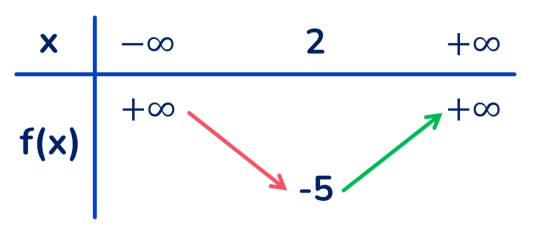

## PHẦN A. KIẾN THỨC CẦN NHỚ

## 1. ĐỒ THỊ HÀM SỐ BẬC HAI

Đồ thị hàm số bậc hai $y=a x^{2}+b x+c \quad (a \neq 0)$ là một parabol có đỉnh là điểm $I\left(-\frac{b}{2 a} ;-\frac{\Delta}{4 a}\right)$, có trục đối xứng là đường thẳng $x=\frac{-b}{2 a}$. Parabol này quay bề lõm lên trên nếu $a>0$, xuống dưới nếu $a<0$.

Để vẽ đường parabol $y=a x^{2}+b x+c \quad (a \neq 0)$, ta thực hiện các bước:

1) Xác định tọa độ đỉnh $I\left(-\frac{b}{2 a} ;-\frac{\Delta}{4 a}\right)$.
2) Vẽ trục đối xứng $x=\frac{-b}{2 a}$.
3) Xác định tọa độ giao điểm của parabol với trục tung và trục hoành (nếu có), và một vài điểm đặc biệt trên parabol.
4) Vẽ parabol.

$a>0$

$a<0$

Nhận xét: Từ đồ thị hàm số $y=a x^{2}+b x+c \quad (a \neq 0)$, ta suy ra tính chất của hàm số $y=a x^{2}+b x+c \quad (a \neq 0)$

| $a>0$ | $a<0$ |
| :--- | :--- |
| - Hàm số nghịch biến trên khoảng $\left(-\infty ;-\frac{b}{2 a}\right)$ và đồng biến trên khoảng $\left(-\frac{b}{2 a} ;+\infty\right)$.   - Bảng biến thiên$x$ $-\infty$ $-\frac{b}{2 a}$ $+\infty$   $y$ $+\infty$  $+\infty$   $-\frac{\Delta}{4 a}$ là giá trị nhỏ nhất của hàm số | - Hàm số đồng biến trên khoảng $\left(-\infty ;-\frac{b}{2 a}\right)$ và nghịch biến trên khoảng $\left(-\frac{b}{2 a} ;+\infty\right)$.   - Bảng biến thiên$x$ $-\infty$ $-\frac{b}{2 a}$ $+\infty$    $y$  $-\frac{\Delta}{4 a}$      $-\infty$  $-\infty$    $-\frac{\Delta}{4 a}$ là giá trị lớn nhất của hàm số |

## 2. XÁC ĐỊNH HÀM SỐ BẬC HAI THỎA MÃN ĐIỀU KIỆN CHO TRƯỚC

Để xác định hàm số bậc hai $y=f(x)=a x^{2}+b x+c$ (đồng nghĩa với xác định các tham số $a, b, c$) ta cần dựa vào giả thiết để lập nên các phương trình (hệ phương trình) ẩn là $a, b, c$. Từ đó tìm được $a, b, c$. Việc lập nên các phương trình nêu ở trên thường sử dụng đến các kết quả sau:

- Đồ thị hàm số đi qua điểm $M\left(x_{0} ; y_{0}\right) \Leftrightarrow y_{0}=f\left(x_{0}\right)$.
- Đồ thị hàm số có trục đối xứng $x=x_{0} \Leftrightarrow-\frac{b}{2 a}=x_{0}$.
- Đồ thị hàm số có đỉnh là $I\left(x_{I} ; y_{I}\right) \Leftrightarrow\left\{\begin{array}{l}-\frac{b}{2 a}=x_{I} \\ -\frac{\Delta}{4 a}=y_{I}\end{array}\right.$ hay $\left\{\begin{array}{c}-\frac{b}{2 a}=x_{I} \\ f\left(x_{I}\right)=y_{I}\end{array}\right.$.
- Trên $\mathbb{R}$, ta có:

1. $f(x)$ có giá trị lớn nhất $\Leftrightarrow a<0$. Lúc này $\max_{\mathbb{R}} f(x)=-\frac{\Delta}{4 a}=f\left(-\frac{b}{2 a}\right)$.
2. $f(x)$ có giá trị nhỏ nhất $\Leftrightarrow a>0$. Lúc này $\min_{\mathbb{R}} f(x)=-\frac{\Delta}{4 a}=f\left(-\frac{b}{2 a}\right)$.

## 3. DẤU CỦA TAM THỨC BẬC HAI

Tam thức bậc hai (đối với $x$) là biểu thức có dạng $a x^{2}+b x+c$, trong đó $a, b, c$ là những số thực cho trước $(a \neq 0)$, được gọi là các hệ số của tam thức bậc hai.

## Định lí về dấu tam thức bậc hai.

Cho tam thức bậc hai $f(x)=a x^{2}+b x+c \quad (a \neq 0)$.
Nếu $\Delta<0$ thì $f(x)$ cùng dấu với hệ số $a$ với mọi $x \in \mathbb{R}$.
Nếu $\Delta=0$ thì $f(x)$ cùng dấu với hệ số $a$ với mọi $x \neq-\frac{b}{2 a}$ và $f\left(-\frac{b}{2 a}\right)=0$.
Nếu $\Delta>0$ thì tam thức $f(x)$ có hai nghiệm phân biệt $x_{1}$ và $x_{2} \quad (x_{1}<x_{2})$. Khi đó, $f(x)$ cùng dấu với hệ số $a$ với mọi $x \in\left(-\infty ; x_{1}\right) \cup\left(x_{2} ;+\infty\right)$; $f(x)$ trái dấu với hệ số $a$ với mọi $x \in\left(x_{1} ; x_{2}\right)$.

Nhớ nhanh: Khi $\Delta>0$, dấu của $f(x)$ và $a$ là: "Trong trái, ngoài cùng"

Chú ý: Trong định lí về tam thức bậc hai có thể thay $\Delta$ bởi $\Delta^{\prime}$.

## 4. PHƯƠNG TRÌNH QUY VỀ PHƯƠNG TRÌNH BẬC HAI

Để giải phương trình $\sqrt{a x^{2}+b x+c}=\sqrt{d x^{2}+e x+f}$, ta thực hiện như sau:

- Bình phương hai vế và giải phương trình nhận được;
- Thử lại các giá trị $x$ tìm được ở trên có thỏa mãn phương trình đã cho hay không và kết luận nghiệm.

Để giải phương trình $\sqrt{a x^{2}+b x+c}=d x+e$, ta thực hiện như sau:
-Bình phương hai vế và giải phương trình nhận được
-Thử lại các giá trị $x$ tìm được ở trên có thỏa mãn phương trình đã cho hay không và kết luận nghiệm.

## PHẦN C. BÀI TẬP TRẮC NGHIỆM

## Dành cho học sinh trung bình

Câu 1. Hàm số $y=a x^{2}+b x+c,(a>0)$ đồng biến trong khoảng nào sau đây?
A. $\left(-\infty ;-\frac{b}{2 a}\right)$.
B. $\left(-\frac{b}{2 a} ;+\infty\right)$.
c. $\left(-\frac{\Delta}{4 a} ;+\infty\right)$.
D. $\left(-\infty ;-\frac{\Delta}{4 a}\right)$.

## Lời giải

## Chọn B

$a>0$.
Bảng biến thiên

Câu 2. Cho hàm số $y=a x^{2}+b x+c$ có đồ thị là parabol trong hình vẽ. Khẳng định nào sau đây là đúng?

A. $a>0 ; b>0 ; c>0$.
B. $a>0 ; b<0 ; c>0$.
c. $a>0 ; b<0 ; c<0$.
D. $a>0 ; b>0 ; c<0$.

## Lời giải

## Chọn D

Vì Parabol hướng bề lõm lên trên nên $a>0$.
Đồ thị hàm số cắt $O y$ tại điểm $(0 ; c)$ ở dưới $O x \Rightarrow c<0$.
Hoành độ đỉnh Parabol là $-\frac{b}{2 a}<0$, mà $a>0 \Rightarrow b>0$.
Câu 3. Cho hàm số $y=a x^{2}+b x+c$ có đồ thị như hình bên.

Khẳng định nào sau đây đúng?
A. $a>0, b>0, c>0$.
B. $a>0, b<0, c<0$.
c. $a<0, b<0, c>0$.
D. $a<0, b>0, c>0$.

## Lời giải

## Chọn D

Dựa vào đồ thị, nhận thấy:

* Đồ thị hàm số là một parabol có bề lõm quay xuống dưới nên $a<0$.
* Đồ thị cắt trục tung tại tung độ bằng $c$ nên $c>0$.
* Đồ thị cắt trục hoành tại hai điểm có hoành độ $x_{1}=-1$ và $x_{2}=3$ nên $x_{1}, x_{2}$ là hai nghiệm của phương trình $a x^{2}+b x+c=0$ mà theo Vi-et $x_{1}+x_{2}=-\frac{b}{a}=2 \Leftrightarrow b=-2 a \Rightarrow b>0$.
* Vậy $a<0, b>0, c>0$.

Câu 4. Đồ thị trong hình vẽ dưới đây là của hàm số nào trong các phương án $A ; B ; C ; D$ sau đây?

A. $y=x^{2}+2 x-1$.
B. $y=x^{2}+2 x-2$.
C. $y=2 x^{2}-4 x-2$.
D. $y=x^{2}-2 x-1$.

## Lời giải

## Chọn D

Đồ thị cắt trục tung tại điểm có tung độ bằng -1 nên loại $\mathbf{B}$ và $\mathbf{C}$
Hoành độ của đỉnh là $x_{I}=-\frac{b}{2 a}=1$ nên ta loại A và chọn D.

## Dành cho học sinh khá giỏi

Câu 5. Cho parabol $y=a x^{2}+b x+c$ có đồ thị như hình sau

Phương trình của parabol này là
A. $y=-x^{2}+x-1$.
B. $y=2 x^{2}+4 x-1$.
c. $y=x^{2}-2 x-1$.
D. $y=2 x^{2}-4 x-1$.

## Lời giải

## Chọn D

Đồ thị hàm số cắt trục tung tại điểm $(0 ;-1)$ nên $c=-1$.

Tọa độ đỉnh $I(1 ;-3)$, ta có phương trình: $\left\{\begin{array}{l}-\frac{b}{2 a}=1 \\ a \cdot 1^{2}+b \cdot 1-1=-3\end{array} \Leftrightarrow\left\{\begin{array}{l}2 a+b=0 \\ a+b=-2\end{array} \Leftrightarrow\left\{\begin{array}{l}a=2 \\ b=-4 \text {. }\end{array}\right.\right.\right.$
Vậy parabol cần tìm là: $y=2 x^{2}-4 x-1$.
Câu 6. Cho parabol $(P): y=a x^{2}+b x+c,(a \neq 0)$ có đồ thị như hình bên. Khi đó $2 a+b+2 c$ có giá trị là

A. -9 .
B. 9.
c. -6 .
D. 6 .

## Lời giải

## Chọn C

Parabol $(P): y=a x^{2}+b x+c,(a \neq 0)$ đi qua các điểm $A(-1 ; 0), B(1 ;-4), C(3 ; 0)$ nên có hệ phương trình: $\left\{\begin{array}{l}a-b+c=0 \\ a+b+c=-4 \\ 9 a+3 b+c=0\end{array} \Leftrightarrow\left\{\begin{array}{l}a=1 \\ b=-2 \\ c=-3\end{array}\right.\right.$.

Khi đó: $2 a+b+2 c=2.1-2+2(-3)=-6$.

Câu 7. Bảng biến thiên ở dưới là bảng biến thiên của hàm số nào trong các hàm số được cho ở bốn phương án $\mathrm{A}, \mathrm{B}, \mathrm{C}, \mathrm{D}$ sau đây?

A. $y=-x^{2}+4 x$.
B. $y=-x^{2}+4 x-9$.
C. $y=x^{2}-4 x-1$.
D. $y=x^{2}-4 x-5$.

## Lời giải

## Chọn C

Parabol cần tìm phải có hệ số $a>0$ và đồ thị hàm số phải đi qua điểm $(2 ;-5)$. Đáp án $\mathbf{C}$ thỏa mãn.

Câu 8. Bảng biến thiên sau đây là bảng biến thiên của hàm số nào?

A. $y=x^{2}+4 x$.
B. $y=-x^{2}-4 x-8$.
C. $y=-x^{2}-4 x+8$.
D. $y=-x^{2}-4 x$.

## Lời giải

## Chọn B

Dựa vào BBT ta thấy:
Parabol có nhánh cuối đi xuống nên $a<0 \Rightarrow$ Loại $\mathbf{A}$.
Parabol có đỉnh $I(-2 ;-4)$ nên thay $x=-2 ; y=-4$ vào các đáp án B, C, D.
Nhận thấy chỉ có đáp án B thỏa mãn.

## Dành cho học sinh trung bình

Câu 9. Giá trị nhỏ nhất của hàm số $y=x^{2}+2 x+3$ đạt được tại
A. $x=-2$.
B. $x=-1$.
c. $x=0$.
D. $x=1$.

## Lời giải

## Chọn B

Ta có: $y=x^{2}+2 x+3=(x+1)^{2}+2 \geq 2, \forall x \in \mathbb{R}$
Dấu bằng xảy ra khi $x=-1$ nên chọn đáp án B.
Câu 10. Giá trị nhỏ nhất của hàm số $y=2 x^{2}+x-3$ là
A. -3 .
B. -2 .
c. $\frac{-21}{8}$.
D. $\frac{-25}{8}$.

## Lời giải

## Chọn D

$y=2 x^{2}+x-3=2\left(x+\frac{1}{4}\right)^{2}-\frac{25}{8} \geq \frac{-25}{8}$
$y=\frac{-25}{8}$ khi $x=\frac{-1}{4}$ nên giá trị nhỏ nhất của hàm số $y=2 x^{2}+x-3$ là $\frac{-25}{8}$.

## Dành cho học sinh khá giỏi

Câu 11. Giá trị lớn nhất của hàm số $y=-3 x^{2}+2 x+1$ trên đoạn $[1 ; 3]$ là:
A. $\frac{4}{5}$
B. 0
c. $\frac{1}{3}$
D. -20

## Lời giải

Ta có $-\frac{b}{2 a}=\frac{1}{3}$ và $a=-3<0$. Suy ra hàm số đã cho nghịch biến trên khoảng $\left(\frac{1}{3} ;+\infty\right)$. Mà $[1 ; 3] \subset\left(\frac{1}{3} ;+\infty\right)$. Do đó trên đoạn $[1 ; 3]$ hàm số đạt giá trị lớn nhất tại điểm $x=1$, tức là $\max _{[1 ; 3]} f(x)=f(1)=0$.

## Đáp án B.

Câu 12. Giá trị lớn nhất của hàm số $y=\frac{2}{x^{2}-5 x+9}$ bằng:
A. $\frac{11}{8}$
B. $\frac{11}{4}$
c. $\frac{4}{11}$
D. $\frac{8}{11}$

## Lời giải

## Đáp án D.

Hàm số $y=x^{2}-5 x+9$ có giá trị nhỏ nhất là $\frac{11}{4}>0$.

Suy ra hàm số $y=\frac{2}{x^{2}-5 x+9}$ có giá trị lớn nhất là $\frac{2}{\frac{11}{4}}=\frac{8}{11}$.

## Dành cho học sinh trung bình

Câu 13. Cho parabol $(P): y=3 x^{2}-2 x+1$. Điểm nào sau đây là đỉnh của $(P)$ ?
A. $I(0 ; 1)$.
B. $I\left(\frac{1}{3} ; \frac{2}{3}\right)$.
C. $I\left(-\frac{1}{3} ; \frac{2}{3}\right)$.
D. $I\left(\frac{1}{3} ;-\frac{2}{3}\right)$.

## Lời giải

## Chọn B

Hoành độ đỉnh của $(P): y=3 x^{2}-2 x+1 \Rightarrow x=-\frac{b}{2 a}=\frac{1}{3} \Rightarrow y=3\left(\frac{1}{3}\right)^{2}-2 \cdot \frac{1}{3}+1=\frac{2}{3}$.
Vậy $I\left(\frac{1}{3} ; \frac{2}{3}\right)$.
Câu 14. Trục đối xứng của đồ thị hàm số $y=a x^{2}+b x+c,(a \neq 0)$ là đường thẳng nào dưới đây?
A. $x=-\frac{b}{2 a}$.
B. $x=-\frac{c}{2 a}$.
C. $x=-\frac{\Delta}{4 a}$.
D. Không có.

## Lời giải

## Chọn A

Trục đối xứng của đồ thị hàm số bậc hai $y = ax^2+bx+c$ ($a \neq 0$) là đường thẳng có phương trình $\displaystyle x = -\frac{b}{2a}$.

Câu 15. Điểm $I(-2 ; 1)$ là đỉnh của Parabol nào sau đây?
A. $y=x^{2}+4 x+5$.
B. $y=2 x^{2}+4 x+1$.
C. $y=x^{2}+4 x-5$.
D. $y=-x^{2}-4 x+3$.

## Lời giải

## Chọn A

Hoành độ đỉnh là $x_{I}=-\frac{b}{2 a}=-2$. Từ đó loại câu B.
Thay hoành độ $x_{I}=-2$ vào phương trình Parabol ở các câu $\mathrm{A}, \mathrm{C}, \mathrm{D}$, ta thấy chỉ có câu A thỏa điều kiện $y_{I}=1$.

## Dành cho học sinh khá giỏi

Câu 16. Xác định các hệ số $a$ và $b$ để Parabol $(P): y=a x^{2}+4 x-b$ có đỉnh $I(-1 ;-5)$.
A. $\left\{\begin{array}{l}a=3 \\ b=-2\end{array}\right.$.
B. $\left\{\begin{array}{l}a=3 \\ b=2\end{array}\right.$.
c. $\left\{\begin{array}{l}a=2 \\ b=3\end{array}\right.$.
D. $\left\{\begin{array}{l}a=2 \\ b=-3\end{array}\right.$.

## Lời giải

## Chọn C

Ta có: $x_{I}=-1 \Rightarrow-\frac{4}{2 a}=-1 \Rightarrow a=2$.
Hơn nữa $I \in(P)$ nên $-5=a-4-b \Rightarrow b=3$.
Câu 17. Biết hàm số bậc hai $y=a x^{2}+b x+c$ có đồ thị là một đường Parabol đi qua điểm $A(-1 ; 0)$ và có đỉnh $I(1 ; 2)$. Tính $a+b+c$.
A. 3 .
B. $\frac{3}{2}$.
c. 2 .
D. $\frac{1}{2}$.

## Lời giải

## Chọn C

Theo giả thiết ta có hệ: $\left\{\begin{array}{l}a-b+c=0 \\ -\frac{b}{2 a}=1 \\ a+b+c=2\end{array}\right.$ với $a \neq 0 \Rightarrow \left\{\begin{array}{l}a-b+c=0 \\ b=-2 a \\ a+b+c=2\end{array} \Leftrightarrow\left\{\begin{array}{l}b=1 \\ a=-\frac{1}{2} \\ c=\frac{3}{2}\end{array}\right.\right.$
Vậy hàm bậc hai cần tìm là $y=-\frac{1}{2} x^{2}+x+\frac{3}{2}$
Câu 18. Biết đồ thị hàm số $y=a x^{2}+b x+c,(a, b, c \in \mathbb{R} ; a \neq 0)$ đi qua điểm $A(2 ; 1)$ và có đỉnh $I(1 ;-1)$. Tính giá trị biểu thức $T=a^{3}+b^{2}-2 c$.
A. $T=22$.
B. $T=9$.
c. $T=6$.
D. $T=1$.

## Lời giải

## Chọn A

Đồ thị hàm số $y=ax^{2}+b x+c$ đi qua điểm $A(2 ; 1)$ và có đỉnh $I(1 ;-1)$ nên có hệ phương trình
$\left\{\begin{array}{l}4 a+2 b+c=1 \\ -\frac{b}{2 a}=1 \\ a+b+c=-1\end{array} \Leftrightarrow\left\{\begin{array}{l}4 a+2 b+c=1 \\ b=-2 a \\ a+b+c=-1\end{array} \Leftrightarrow\left\{\begin{array}{l}c=1 \\ b=-2 a \\ -a+c=-1\end{array} \Leftrightarrow\left\{\begin{array}{l}c=1 \\ b=-4 \\ a=2\end{array}\right.\right.\right.\right.$
Vậy $T=a^{3}+b^{2}-2 c=22$.
Câu 19. Cho hàm số $y=a x^{2}+b x+c(a \neq 0)$ có đồ thị ( P ). Biết đồ thị của hàm số có đỉnh $I(1 ; 1)$ và đi qua điểm $A(2 ; 3)$. Tính tổng $S=a^{2}+b^{2}+c^{2}$
A. 3 .
B. 4 .
c. 29 .
D. 1 .

## Lời giải

## Chọn C

Vì đồ thị hàm số $y=a x^{2}+b x+c(a \neq 0)$ có đỉnh $I(1 ; 1)$ và đi qua điểm $A(2 ; 3)$ nên ta có hệ:

$$
\left\{\begin{array} { c } 
{ a + b + c = 1 } \\
{ 4 a + 2 b + c = 3 } \\
{ - \frac { b } { 2 a } = 1 }
\end{array} \Leftrightarrow \left\{\begin{array} { c } 
{ a + b + c = 1 } \\
{ 4 a + 2 b + c = 3 } \\
{ 2 a + b = 0 }
\end{array} \Leftrightarrow \left\{\begin{array}{c}
a=2 \\
b=-4 \\
c=3
\end{array}\right.\right.\right.
$$

Nên $S=a^{2}+b^{2}+c^{2}=29$
Câu 20. Cho Parabol $(P): y=x^{2}+m x+n$ ( $m, n$ tham số). Xác định $m, n$ để $(P)$ nhận điểm $I(2 ;-1)$ làm đỉnh.

A. $m=4, n=-3$.
B. $m=4, n=3$.
c. $m=-4, n=-3$.
D. $m=-4, n=3$.

## Lời giải

## Chọn D

Parabol $(P): y=x^{2}+m x+n$ nhận $I(2 ;-1)$ là đỉnh, khi đó ta có
$\left\{\begin{array}{l}4+2 m+n=-1 \\ -\frac{m}{2}=2\end{array} \Leftrightarrow\left\{\begin{array}{l}2 m+n=-5 \\ m=-4\end{array} \Leftrightarrow\left\{\begin{array}{l}n=3 \\ m=-4\end{array}\right.\right.\right.$
Vậy $m=-4, n=3$.
Câu 21. Cho Parabol (P): $y=a x^{2}+b x+c$ có đỉnh $I(2 ; 0)$ và $(P)$ cắt trục $O y$ tại điểm $M(0 ;-1)$. Khi đó Parabol (P) có hàm số là
A. $(P): y=-\frac{1}{4} x^{2}-3 x-1$.
B. $(P): y=-\frac{1}{4} x^{2}-x-1$.
c. $(P): y=-\frac{1}{4} x^{2}+x-1$.
D. $(P): y=-\frac{1}{4} x^{2}+2 x-1$

## Lời giải

## Chọn C

Parabol $(P): y=a x^{2}+b x+c \longrightarrow$ đỉnh $I\left(-\frac{b}{2 a} ; c-\frac{b^{2}}{4 a}\right)$

Theo bài ra, ta có (P) đỉnh

$$
I(2 ; 0) \Rightarrow\left\{\begin{array} { l } 
{ - \frac { b } { 2 a } = 2 } \\
{ c - \frac { b ^ { 2 } } { 4 a } = 0 }
\end{array} \Leftrightarrow \left\{\begin{array}{l}
b=-4 a \\
b^{2}=4 a c
\end{array}\right.\right.
$$

Lại có ( P ) cắt Oy tại điểm $M(0 ;-1)$ suy ra $y(0)=-1 \Leftrightarrow c=-1$

Từ (1), (2) suy ra $\left\{\begin{array}{l}b=-4 a \\ b^{2}=-a \\ c=-1\end{array} \Leftrightarrow\left\{\begin{array}{l}b=-4 a \\ b^{2}=b \\ c=-1\end{array} \Leftrightarrow\left\{\begin{array}{l}a=-\frac{1}{4} \\ b=1 ; c=-1\end{array}\right.\right.\right.$ (vì $b=0 \Rightarrow a=0$ loại)
Câu 22. Gọi $S$ là tập các giá trị $m \neq 0$ để parabol $(P): y=m x^{2}+2 m x+m^{2}+2 m$ có đỉnh nằm trên đường thẳng $y=x+7$. Tính tổng các giá trị của tập $S$
A. -1 .
B. 1 .
c. 2 .
D. -2 .

## Lời giải

## Chọn A

Khi $m \neq 0$ thì $(P): y=m x^{2}+2 m x+m^{2}+2 m$ có đỉnh là $I\left(-\frac{b}{2 a} ;-\frac{\Delta}{4 a}\right) \Rightarrow I\left(-1 ; m^{2}+m\right)$
Vì đỉnh nằm trên đường thẳng $y=x+7$ nên
$m^{2}+m=-1+7 \Leftrightarrow m^{2}+m-6=0 \Leftrightarrow\left[\begin{array}{l}m=2 \\ m=-3\end{array}(T M)\right.$
Vậy tổng các giá trị của tập $S: 2+(-3)=-1$.
Câu 23. Xác định hàm số $y=a x^{2}+b x+c$ biết đồ thị của nó có đỉnh $I\left(\frac{3}{2} ; \frac{1}{4}\right)$ và cắt trục hoành tại điểm có hoành độ bằng 2 .
A. $y=-x^{2}+3 x+2$.
B. $y=-x^{2}-3 x-2$.
c. $y=x^{2}-3 x+2$.
D. $y=-x^{2}+3 x-2$.

## Lời giải

## Chọn D

Do đồ thị của nó có đỉnh $I\left(\frac{3}{2} ; \frac{1}{4}\right)$ và cắt trục hoành tại điểm có hoành độ bằng 2 nên ta có $\left\{\begin{array}{l}\frac{-b}{2 a}=\frac{3}{2} \\ \frac{9}{4} a+\frac{3}{2} b+c=\frac{1}{4} \\ 4 a+2 b+c=0\end{array} \Leftrightarrow\left\{\begin{array}{l}3 a+b=0 \\ 9 a+6 b+4 c=1 \\ 4 a+2 b+c=0\end{array} \Leftrightarrow\left\{\begin{array}{l}a=-1 \\ b=3 \\ c=-2\end{array}\right.\right.\right.$

Vậy $y=-x^{2}+3 x-2$
Câu 24. Hàm số bậc hai nào sau đây có đồ thị là parabol có đỉnh là $S\left(\frac{5}{2} ; \frac{1}{2}\right)$ và đi qua $A(1 ;-4)$?
A. $y=-x^{2}+5 x-8$.
B. $y=-2 x^{2}+10 x-12$.
C. $y=x^{2}-5 x$.
D. $y=-2 x^{2}+5 x+\frac{1}{2}$.

## Lời giải

## Chọn B

Hàm số bậc hai cần tìm có phương trình: $y=a x^{2}+b x+c(a \neq 0)$
Hàm số bậc hai có đồ thị là parabol có đỉnh là $S\left(\frac{5}{2} ; \frac{1}{2}\right)$ và đi qua $A(1 ;-4)$
$\Rightarrow\left\{\begin{array}{l}\frac{-b}{2 a}=\frac{5}{2} \\ \frac{-\Delta}{4 a}=\frac{1}{2} \\ a+b+c=-4\end{array} \Leftrightarrow\left\{\begin{array}{l}b=-5 \mathrm{a} \\ \frac{-25 a^{2}+4 \mathrm{a}(4 \mathrm{a}-4)}{4 a}=\frac{1}{2} \\ c=4 \mathrm{a}-4\end{array} \Leftrightarrow\left\{\begin{array}{l}a=-2 \\ b=10 \\ c=-12\end{array}\right.\right.\right.$

## Dành cho học sinh trung bình

Câu 25. Cho parabol $(P)$ có phương trình $y=a x^{2}+b x+c$. Tìm $a+b+c$, biết $(P)$ đi qua điểm $A(0 ; 3)$ và có đỉnh $I(-1 ; 2)$.
A. $a+b+c=6$
B. $a+b+c=5$
c. $a+b+c=4$
D. $a+b+c=3$

## Lời giải

$(P)$ đi qua điểm $A(0 ; 3) \Rightarrow c=3$.
$(P)$ có đỉnh

$$
I(-1 ; 2) \Rightarrow\left\{\begin{array} { l } 
{ \frac { - b } { 2 a } = - 1 } \\
{ a - b + 3 = 2 }
\end{array} \Leftrightarrow \left\{\begin{array} { l } 
{ b = 2 a } \\
{ a - 2 a = - 1 }
\end{array} \Leftrightarrow \left\{\begin{array}{l}
a=1 \\
b=2
\end{array} \Rightarrow a+b+c=6\right.\right.\right.
$$

## Đáp án A.

## Dành cho học sinh khá giỏi

Câu 26. Parabol $y=a x^{2}+b x+c$ đạt cực tiểu bằng 4 tại $x=-2$ và đi qua $A(0 ; 6)$ có phương trình là
A. $y=\frac{1}{2} x^{2}+2 x+6$.
B. $y=x^{2}+2 x+6$.
c. $y=x^{2}+6 x+6$.
D. $y=x^{2}+x+4$.

## Lời giải

## Chọn A

Ta có: $-\frac{b}{2 a}=-2 \Rightarrow b=4 a \quad$.(1)

Mặt khác : Vì $A, I \in(P) \Leftrightarrow\left\{\begin{array}{l}4=a \cdot(-2)^{2}+b \cdot(-2)+c \\ 6=a \cdot(0)^{2}+b \cdot(0)+c\end{array} \Rightarrow\left\{\begin{array}{l}4 \cdot a-2 b=-2 \\ c=6\end{array}\right.\right.$

Kết hợp (1),(2) ta có : $\left\{\begin{array}{l}a=\frac{1}{2} \\ b=2 \\ c=6 \\ \quad \text {. Vậy }\end{array}(P): y=\frac{1}{2} x^{2}+2 x+6\right.$.

## Dành cho học sinh trung bình

Câu 27. Parabol $y=a x^{2}+b x+c$ đi qua $A(0 ;-1), B(1 ;-1), C(-1 ; 1)$ có phương trình là
A. $y=x^{2}-x+1$.
B. $y=x^{2}-x-1$.
C. $y=x^{2}+x-1$.
D. $y=x^{2}+x+1$.

## Lời giải

## Chọn B

Ta có: Vì $A, B, C \in(P) \quad \Leftrightarrow\left\{\begin{array}{l}-1=a \cdot 0^{2}+b \cdot 0+c \\ -1=a \cdot(1)^{2}+b \cdot(1)+c \\ 1=a \cdot(-1)^{2}+b \cdot(-1)+c\end{array} \Rightarrow\left\{\begin{array}{l}a=1 \\ b=-1 \\ c=-1\end{array}\right.\right.$.
Vậy $(P): y=x^{2}-x-1$.
Câu 28. Gọi $A(a ; b)$ và $B(c ; d)$ là tọa độ giao điểm của $(P): y=2 x-x^{2}$ và $\Delta: y=3 x-6$. Giá trị của $b+d$ bằng.
A. 7 .
B. -7 .
C. 15 .
D. -15 .

## Lời giải

## Chọn D

Phương trình hoành độ giao điểm: $2 x-x^{2}=3 x-6 \Leftrightarrow x^{2}+x-6=0 \Leftrightarrow\left[\begin{array}{l}x=2 \Rightarrow y=0 \\ x=-3 \Rightarrow y=-15\end{array}\right.$
$b+d=-15$

## Dành cho học sinh khá giỏi

Câu 29. Cho hai parabol có phương trình $y=x^{2}+x+1$ và $y=2 x^{2}-x-2$. Biết hai parabol cắt nhau tại hai điểm $A$ và $B$ ( $x_{A}<x_{B}$ ). Tính độ dài đoạn thẳng $A B$.
A. $A B=4 \sqrt{2}$
B. $A B=2 \sqrt{26}$
C. $A B=4 \sqrt{10}$
D. $A B=2 \sqrt{10}$

## Lời giải

Phương trình hoành độ giao điểm của hai parabol:
$2 x^{2}-x-2=x^{2}+x+1 \Leftrightarrow x^{2}-2 x-3=0 \Leftrightarrow\left[\begin{array}{l}x=-1 \\ x=3\end{array}\right.$.
$x=-1 \Rightarrow y=1 ; x=3 \Rightarrow y=13$, do đó hai giao điểm là $A(-1 ; 1)$ và $B(3 ; 13)$.
Từ đó $A B=\sqrt{(3+1)^{2}+(13-1)^{2}}=4 \sqrt{10}$.
Đáp án C.
Câu 30. Hàm số $y=x^{2}+2 x-1$ có đồ thị như hình bên. Tìm các giá trị $m$ để phương trình $x^{2}+2 x+m=0$ vô nghiệm.

A. $m<-2$.
B. $m<-1$.
c. $m<1$.
D. $m>1$.

## Lời giải

## Chọn D

$x^{2}+2 x+m=0 \Leftrightarrow x^{2}+2 x-1=-m-1 \quad\left({ }^{*}\right)$
Số nghiệm của phương trình ${ }^{(*)}$ chính là số giao điểm của parabol $y=x^{2}+2 x-1$ và đường thẳng $y=-m-1$.

Ycbt $\Rightarrow m>1$.

## Dành cho học sinh trung bình

Câu 31. Cho hàm số $f(x)=x^{2}+2 x+m$. Với giá trị nào của tham số $m$ thì

$$
f(x) \geq 0, \forall x \in \mathbb{R}
$$

A. $m \geq 1$.
B. $m>1$.
C. $m>0$.
D. $m<2$.

## Lời giải

## Chọn A.

Ta có $f(x) \geq 0, \forall x \in \mathbb{R} \Leftrightarrow\left\{\begin{array}{l}a=1>0 \\ \Delta^{\prime}=1-m \leq 0\end{array} \Leftrightarrow m \geq 1\right.$.
Câu 32. Tìm tất cả các giá trị của tham số $m$ để bất phương trình

$$
x^{2}-(m+2) x+8 m+1 \leq 0 \text { vô nghiệm. }
$$

A. $m \in[0 ; 28]$
B. $m \in(-\infty ; 0) \cup(28 ;+\infty)$.
c. $m \in(-\infty ; 0] \cup[28 ;+\infty)$.
D. $m \in(0 ; 28)$.

## Lời giải

## Chọn D

Bất phương trình vô nghiệm khi và chỉ khi $(m+2)^{2}-4(8 m+1)<0 \Leftrightarrow m^{2}-28 m<0 \Leftrightarrow 0<m<28$.

## Dành cho học sinh trung bình

Câu 33. Tam thức $f(x)=x^{2}+2(m-1) x+m^{2}-3 m+4$ không âm với mọi giá trị của $x$ khi
A. $m<3$.
B. $m \geq 3$.
C. $m \leq-3$.
D. $m \leq 3$.

## Lời giải

## Chọn D

Yêu cầu bài toán $\Leftrightarrow f(x) \geq 0, \forall x \in \mathbb{R} \Leftrightarrow x^{2}+2(m-1) x+m^{2}-3 m+4 \geq 0, \forall x \in \mathbb{R}$
$\Leftrightarrow \Delta^{\prime}=(m-1)^{2}-\left(m^{2}-3 m+4\right) \leq 0$
$\Leftrightarrow m-3 \leq 0$
$\Leftrightarrow m \leq 3$.

Vậy $m \leq 3$ thỏa mãn yêu cầu bài toán.

## Dành cho học sinh khá giỏi

Câu 34. Tìm các giá trị của $m$ để biểu thức $f(x)=x^{2}+(m+1) x+2 m+7>0 \quad \forall x \in \mathbb{R}$
A. $m \in[2 ; 6]$.
B. $m \in(-3 ; 9)$
C. $m \in(-\infty ; 2) \cup(5 ;+\infty)$.
D. $m \in(-9 ; 3)$.

## Lời giải

## Chọn B

Ta có :

$$
f(x)>0, \forall x \in \mathbb{R} \Leftrightarrow\left\{\begin{array} { l } 
{ a > 0 } \\
{ \Delta < 0 }
\end{array} \Leftrightarrow \left\{\begin{array}{l}
1>0 \\
(m+1)^{2}-4(2 m+7)<0
\end{array}\right.\right.
$$

$\Leftrightarrow m^{2}-6 m-27<0 \Leftrightarrow-3<m<9$.
Câu 35. Tìm $m$ để $f(x)=m x^{2}-2(m-1) x+4 m$ luôn luôn âm
A. $\left(-1 ; \frac{1}{3}\right)$.
B. $(-\infty ;-1) \cup\left(\frac{1}{3} ;+\infty\right)$
C. $(-\infty ;-1)$.
D. $\left(\frac{1}{3} ;+\infty\right)$.

## Lời giải

## Chọn C

TH1: $m=0: f(x)=2 x$ đổi dấu (loại $m=0$ )
TH2: $m \neq 0$; Yêu cầu bài toán $\Leftrightarrow\left\{\begin{array}{l}a<0 \\ \Delta^{\prime}<0\end{array} \Leftrightarrow\left\{\begin{array}{l}m<0 \\ -3 m^{2}-2 m+1<0\end{array}\right.\right.$
$\Leftrightarrow\left\{\begin{array}{l}m<0 \\ m<-1 \vee m>\frac{1}{3}\end{array}\right.$
$\Leftrightarrow m<-1$
Vậy $m<-1$.

Câu 36. Tổng các nghiệm của phương trình $\sqrt{x^{3}+x^{2}+6 x+28}=x+5$ bằng:
A. 0 .
B. 1 .
c. 2 .
D. -1 .

## Lời giải

Chọn A
$\sqrt{x^{3}+x^{2}+6 x+28}=x+5 \Leftrightarrow\left\{\begin{array}{l}x+5 \geq 0 \\ x^{3}+x^{2}+6 x+28=(x+5)^{2}\end{array} \Leftrightarrow\left\{\begin{array}{l}x \geq-5 \\ x^{3}-4 x+3=0\end{array}\right.\right.$
$\Leftrightarrow\left\{\begin{array}{l}x \geq-5 \\ {\left[\begin{array}{l}x=1 \\ x=\frac{-1 \pm \sqrt{13}}{2}\end{array}\right.}\end{array} \Rightarrow\left[\begin{array}{l}x=1 \\ x=\frac{-1 \pm \sqrt{13}}{2}\end{array}\right.\right.$
Tổng các nghiệm là: 0 .

## Dành cho học sinh trung bình

Câu 37. Tập nghiệm của phương trình $\sqrt{3-x}=\sqrt{x+2}$ là
A. $S=\varnothing$.
B. $S=\left\{-2 ; \frac{1}{2}\right\}$.
c. $S=\left\{\frac{1}{2}\right\}$.
D. $S=\left\{-\frac{1}{2}\right\}$.

## Lời giải

## Chọn C

Điều kiện: $\left\{\begin{array}{l}3-x \geq 0 \\ x+2 \geq 0\end{array} \Leftrightarrow-2 \leq x \leq 3\right.$.
Phương trình tương đương: $3-x=x+2 \Leftrightarrow 1=2 x \Leftrightarrow x=\frac{1}{2}$ (thỏa mãn điều kiện).
Vậy phương trình có tập nghiệm $S=\left\{\frac{1}{2}\right\}$.
Câu 38. Tập nghiệm của phương trình $\left(x^{2}-x-2\right) \cdot \sqrt{x-1}=0$ là
A. $\{1 ; 2\}$.
B. $\{-1 ; 1 ; 2\}$.
c. $[1 ; 2]$.
D. $\{-1 ; 2\}$.

## Lời giải

## Chọn A

Điều kiện: $x \geq 1$.
$\left(x^{2}-x-2\right) \cdot \sqrt{x-1}=0 \Leftrightarrow\left[\begin{array}{l}x^{2}-x-2=0 \\ \sqrt{x-1}=0\end{array} \Leftrightarrow\left[\begin{array}{l}x=-1 \\ x=2 \\ x=1\end{array}\right.\right.$
So sánh điều kiện, kết luận phương trình có nghiệm $x=1 ; x=2$.

## Dành cho học sinh khá giỏi

Câu 39. Số nghiệm của phương trình $\sqrt{3 x+1}-\sqrt{2-x}=1$ là
A. 3 .
B. 0 .
C. 1 .
D. 2 .

## Lời giải

## Chọn C

- Điều kiện:

$$
\left\{\begin{array} { c } 
{ 3 x + 1 \geq 0 } \\
{ 2 - x \geq 0 }
\end{array} \Leftrightarrow \left\{\begin{array}{c}
x \geq-\frac{1}{3} \\
x \leq 2
\end{array} \Leftrightarrow-\frac{1}{3} \leq x \leq 2\right.\right.
$$

- PT $\Leftrightarrow \sqrt{3 x+1}=1+\sqrt{2-x} \Leftrightarrow[\sqrt{3 x+1}]^{2}=[1+\sqrt{2-x}]^{2} \Leftrightarrow 3 x+1=1+2 \sqrt{2-x}+2-x$
$\Leftrightarrow 2 \sqrt{2-x}=4 x-2 \Leftrightarrow \sqrt{2-x}=2 x-1 \Leftrightarrow\left\{\begin{array}{l}2 x-1 \geq 0 \\ 2-x=(2 x-1)^{2}\end{array} \Leftrightarrow\left\{\begin{array}{l}x \geq \frac{1}{2} \\ 2-x=4 x^{2}-4 x+1\end{array}\right.\right.$
$\Leftrightarrow\left\{\begin{array}{l}x \geq \frac{1}{2} \\ 4 x^{2}-3 x-1=0\end{array}\right. \Leftrightarrow\left\{\begin{array}{l}x \geq \frac{1}{2} \\ {\left[\begin{array}{l}x=1 \\ x=-\frac{1}{4}\end{array} \Leftrightarrow x=1 \text { (thỏa mãn điều kiện). }\right.}\end{array}\right.$
Vậy phương trình đã cho có một nghiệm $x=1$.

Câu 40. Số nghiệm nguyên của phương trình sau $\sqrt{x+3}-\sqrt{2 x-1}=1$ là:
A. 0 .
B. 2 .
C. 1 .
D. 3 .

## Lời giải

## Chọn C

$\sqrt{x+3}-\sqrt{2 x-1}=1$
Điều kiện $\left\{\begin{array}{l}x+3 \geq 0 \\ 2 x-1 \geq 0\end{array} \Leftrightarrow x \geq \frac{1}{2}\right.$.
Khi đó phương trình $\Leftrightarrow \sqrt{x+3}=1+\sqrt{2 x-1}$

$$
\begin{aligned}
& \Leftrightarrow x+3=1+2 \sqrt{2 x-1}+2 x-1 \Leftrightarrow 2 \sqrt{2 x-1}=-x+3
\end{aligned} \Leftrightarrow\left\{\begin{array}{l}
-x+3 \geq 0 \\
4(2 x-1)=(-x+3)^{2}
\end{array}\right. \Leftrightarrow\left\{\begin{array}{l}
x \leq 3 \\
x^{2}-14 x+13=0 \Leftrightarrow x=1
\end{array}\right.
$$

Vậy số nghiệm nguyên của phương trình là 1 .
