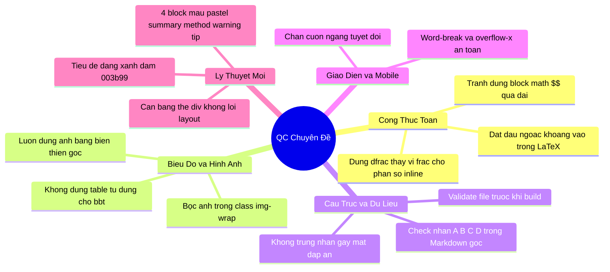

# 📘 SỔ TAY RÚT KINH NGHIỆM PHÁT TRIỂN CHUYÊN ĐỀ WEB

Tài liệu này tổng hợp các lỗi giao diện, công thức toán và bố cục thường gặp trong quá trình xây dựng các trang chuyên đề Toán học. Tí và Tô (hoặc các Agent hỗ trợ) cần **đọc kỹ tài liệu này trước khi bắt đầu tạo hoặc cập nhật bất kỳ chuyên đề mới nào** để đảm bảo chất lượng hiển thị tốt nhất trên cả Desktop và Mobile.

---

## 📌 DANH SÁCH BÀI HỌC KINH NGHIỆM XƯƠNG MÁU



---

### 1. Phân số hiển thị quá nhỏ và co cụm (Dính chùm)
* **Hiện tượng**: Các phân số viết trong dòng văn bản (inline math) hiển thị cực kỳ nhỏ, nét chữ co cụm lại rất khó đọc.
* **Nguyên nhân**: Sử dụng lệnh LaTeX `\frac{ tử }{ mẫu }` thô trong inline math (được bọc bởi `$ ... $`). KaTeX mặc định sẽ nén phân số inline lại để giữ chiều cao dòng.
* **Giải pháp**: 
  - Thay thế toàn bộ `\frac` bằng `\dfrac` (display fraction) ở các phân số inline.
  - *Ví dụ*: 
    - ❌ Sai: `Với $x \in \left(\frac{\pi}{4}; \frac{\pi}{2}\right]$`
    -  Đúng: `Với $x \in \left(\dfrac{\pi}{4}; \dfrac{\pi}{2}\right]$`

---

### 2. Tràn màn hình và mất công thức trên Mobile
* **Hiện tượng**: Một phần công thức toán học bị mất ở lề phải trên màn hình hẹp, hoặc xuất hiện thanh cuộn ngang gây vỡ bố cục.
* **Nguyên nhân**: Sử dụng block math `$$ ... $$` cho các chuỗi công thức dài hoặc liệt kê nhiều hàm số trên cùng một dòng. Công thức block math không thể tự động xuống dòng khi thiếu không gian.
* **Giải pháp**:
  - Tách chuỗi công thức dài thành các cụm inline math `$ ... $` riêng biệt, kết nối bằng dấu phẩy và các từ nối thông thường.
  - *Ví dụ*:
    - ❌ Sai: `$$y=\sin \left(2 x+\frac{\pi}{6}\right), y=\cos \left(2 x+\frac{\pi}{6}\right) \text{ và } y=\cot \left(2x+\frac{\pi}{6}\right)$$`
    -  Đúng: `$y=\sin\left(2x+\dfrac{\pi}{6}\right)$, $y=\cos\left(2x+\dfrac{\pi}{6}\right)$ và $y=\cot\left(2x+\dfrac{\pi}{6}\right)$`

---

### 3. Thiếu ngoặc hoặc sai định dạng khoảng toán học
* **Hiện tượng**: Các khoảng giá trị bị hiển thị thiếu ngoặc (ví dụ: `0 ; \pi` thay vì `(0 ; \pi)`) hoặc dấu ngoặc hiển thị sai font chữ.
* **Nguyên nhân**:
  - Do lỗi gõ phím thiếu ngoặc trong file markdown.
  - Đặt dấu ngoặc nằm ngoài khối LaTeX của công thức khiến khoảng cách bị giãn cách quá rộng hoặc font chữ không đồng nhất.
* **Giải pháp**:
  - Kiểm tra kỹ các dấu ngoặc khoảng, tập xác định trong file markdown.
  - Luôn đưa toàn bộ dấu ngoặc khoảng vào trong khối LaTeX.
  - *Ví dụ*:
    - ❌ Sai: `hàm số đồng biến trên ( $0 ; \frac{\pi}{4}$ )`
    -  Đúng: `hàm số đồng biến trên $\left(0 ; \dfrac{\pi}{4}\right)$`

---

### 4. Mất đáp án trắc nghiệm (Thường là đáp án D)
* **Hiện tượng**: Câu hỏi trắc nghiệm chỉ hiện A, B, C; ô đáp án D trống trơn hoặc nội dung đáp án C bị hiển thị sai lệch.
* **Nguyên nhân**: Lỗi trùng nhãn đáp án trong file Markdown gốc (ví dụ: gõ nhầm hai đáp án là `C.`). Khi parser chạy build HTML, dòng đáp án C thứ hai sẽ ghi đè lên dòng C thứ nhất, khiến đáp án D bị khuyết nội dung.
* **Giải pháp**:
  - Phải kiểm tra file `.md` gốc trước khi build, đảm bảo 4 đáp án luôn đi theo đúng thứ tự nhãn: `A.`, `B.`, `C.`, `D.`.
  - Nếu phát hiện mất đáp án trong HTML, kiểm tra ngay file `.md` tại câu đó để sửa lại nhãn trùng.

---

### 5. Bảng biến thiên hiển thị thô và lệch lạc
* **Hiện tượng**: Bảng biến thiên dựng bằng HTML `<table>` hiển thị rất xấu, các mũi tên chỉ hướng không mượt mà, vạch kép không thẳng hàng.
* **Nguyên nhân**: Mathpix OCR nhận diện bảng biến thiên từ PDF/Word gốc và dịch nó thành bảng Markdown/HTML thô. Giao diện web không thể hiển thị mượt mà các ký hiệu vẽ toán học này bằng bảng chữ thông thường.
* **Giải pháp**:
  - **Không tự dựng bảng biến thiên bằng table**.
  - Crop trực tiếp ảnh bảng biến thiên gốc từ tài liệu, lưu vào thư mục `pic/` của chuyên đề tương ứng dưới dạng `.png` hoặc `.jpg`.
  - Chạy script `tools/upload_images.py` để đẩy ảnh lên Cloudinary và lấy link chèn vào HTML thông qua thẻ `<div class="img-wrap"></div>`.

---

### 6. Tránh lỗi cuộn ngang giao diện (Vỡ responsive)
* **Hiện tượng**: Trang web có thể bị vuốt lệch sang hai bên (cuộn ngang) trên màn hình mobile, tạo cảm giác thiếu chuyên nghiệp.
* **Giải pháp**:
  - Luôn đảm bảo thẻ `body` và container chính có thuộc tính CSS: `overflow-x: hidden !important; width: 100% !important;`.
  - Các bảng lý thuyết (`table`) hoặc ảnh minh họa to phải được bọc trong các thẻ `div` có class hỗ trợ cuộn riêng biệt (ví dụ: style `overflow-x: auto; width: 100%;` hoặc class `img-wrap`).
  - Các công thức KaTeX inline có kích thước dài cần được giới hạn `max-width: 100%; overflow-x: auto;`.

---

### 7. Parser split nhầm "Giải phương trình..." thành "Lời giải" (CD06)
* **Hiện tượng**: Đề bài và 4 đáp án ABCD bị "nuốt" hết vào phần lời giải. Mặt trước câu hỏi trống trơn, không có nút bấm.
* **Nguyên nhân**: Regex split lời giải trong `build_html.py` dùng từ khóa `Giải` quá rộng, match cả "Giải phương trình..." trong đề bài.
* **Giải pháp**:
  - Đã sửa regex thành `Giải\s*[:.]*\s*$` (chỉ match "Giải" đứng một mình trên dòng).
  - **Khi viết parser mới**: Luôn ưu tiên match `Lời giải` đầy đủ, tránh dùng từ khóa ngắn quá generic.

---

### 8. OCR mất dấu "Câu X." gây gộp câu (CD06)
* **Hiện tượng**: HTML bị nhảy cóc số thứ tự, mất hẳn một số câu (VD: Câu 21, 31, 53, 59).
* **Nguyên nhân**: Phần mềm quét PDF (Mathpix OCR) quét sót chữ "Câu X." ở đầu đề bài, khiến parser gộp câu đó vào lời giải câu trước.
* **Giải pháp**:
  - Sau khi OCR xong, **luôn chạy script kiểm tra** tính liên tục số thứ tự câu hỏi (1 → N không nhảy cóc).
  - Nếu phát hiện thiếu câu, mở file `.md` và gõ thêm `Câu X.` vào đầu dòng tương ứng.

---

### 9. Link ảnh Mathpix hết hạn sau 24h (CD06)
* **Hiện tượng**: Ảnh đồ thị/đường tròn lượng giác hiển thị bình thường lúc đầu, nhưng sau 1-2 ngày thì bị vỡ (lỗi 403/404).
* **Nguyên nhân**: Link ảnh dạng `https://cdn.mathpix.com/cropped/...` là link tạm thời từ server OCR, không phải hosting vĩnh viễn.
* **Giải pháp**:
  - **Tuyệt đối không dùng link `cdn.mathpix.com` trực tiếp trong HTML.**
  - Quy trình chuẩn: Tải ảnh về → Lưu vào `pic/` → Upload lên Cloudinary → Dùng link Cloudinary.
  - Script kiểm tra: `grep -i "cdn.mathpix.com" file.md` — nếu có kết quả thì phải thay.

---

### 10. Đáp án bị thiếu do tác giả không ghi "Chọn X" (CD06)
* **Hiện tượng**: Hơn 60 câu hỏi có `data-correct=""` rỗng, học sinh bấm đáp án nào cũng bị báo Sai.
* **Nguyên nhân**: Parser tìm dòng `## Chọn A/B/C/D` trong lời giải để gán đáp án. Tuy nhiên tác giả tài liệu gốc chỉ kết luận nghiệm mà không ghi dòng "Chọn đáp án".
* **Giải pháp**:
  - **Trước khi build**: Chạy script tự động thêm `## Chọn X` vào cuối mỗi câu thiếu.
  - **Sau khi build**: Kiểm tra số lượng `data-correct=""` trong HTML. Nếu > 0 → phải fix.
  - Nâng cấp parser: Thêm logic suy luận đáp án từ nội dung lời giải (pattern matching kết luận).

---

### 11. Thống nhất giao diện lý thuyết (Theory) theo hệ thống block màu pastel
* **Hiện tượng**: Giao diện phần lý thuyết trước đây hiển thị thô sơ, chỉ có tiêu đề và văn bản thô với class `.theory-item`, gây nhàm chán và khó theo dõi cấu trúc kiến thức.
* **Giải pháp**: 
  - Sử dụng thống nhất hệ thống **4 block màu pastel** (đáp ứng tính trực quan cao và sạch sẽ):
    1. **Lý thuyết tổng quan / Kiến thức nền tảng**: Dùng `.theory-block.summary` (nền xanh lá cây pastel `#f0fdf4`, viền `#dcfce7`, chữ tiêu đề màu xanh lá `#16a34a`).
    2. **Phương pháp giải / Hướng dẫn giải**: Dùng `.theory-block.method` (nền xanh dương pastel `#eff6ff`, viền `#dbeafe`, chữ tiêu đề màu xanh dương `#2563eb`).
    3. **Lưu ý / Cảnh báo quan trọng**: Dùng `.theory-block.warning` (nền đỏ/hồng pastel `#fef2f2`, viền `#fee2e2`, chữ tiêu đề màu đỏ `#dc2626`).
    4. **Mẹo / Ví dụ minh họa phụ**: Dùng `.theory-block.tip` (nền vàng/amber pastel `#fffbeb`, viền `#fef3c7`, chữ tiêu đề màu cam `#d97706`).
  - Toàn bộ tiêu đề dạng bài `.theory-h2` phải để màu xanh dương đậm của lớp học (`var(--dark-blue, #003b99)`).
  - Đảm bảo đóng đầy đủ các block bằng `</div><!-- /theory-block -->` và cân bằng thẻ `div` trong toàn bộ file HTML để tránh lỗi vỡ layout hoặc mất nút đóng modal lý thuyết.

---

### 12. Lỗi vỡ layout do mất cân bằng div lý thuyết và lọt tiêu đề dạng bài trắc nghiệm (CD05)
* **Hiện tượng**: 
  - Trang web bị vỡ giao diện hoàn toàn, nút đóng modal lý thuyết bị ẩn hoặc đẩy ra ngoài, các slide trắc nghiệm hiển thị lỗi.
  - Tiêu đề dạng bài trắc nghiệm (ví dụ: `### Dạng 4. Sự đồng biến...`) bị chui lọt vào trong ô Lời giải (`.sol-body`) của câu hỏi ngay trước đó (như Câu 50 trong CD05).
* **Nguyên nhân**:
  - Quá trình chuyển đổi hoặc chỉnh sửa regex bị cắt cụt phần lý thuyết, chèn thừa các thẻ đóng `</div></div>` dẫn đến việc đóng sớm các container bao quanh modal (`.modal-content`, `#theoryModal`), đẩy toàn bộ slide và phần code script sau đó ra ngoài.
  - Bộ parser split lời giải dựa trên các ký tự tiêu đề phân tách nhưng không lọc bỏ dòng tiêu đề dạng bài `### Dạng X`, dẫn đến việc nó bị gộp vào phần lời giải của câu hỏi trước.
* **Giải pháp**:
  - **Luôn chạy script kiểm tra độ cân bằng thẻ div** sau khi biên dịch hoặc chỉnh sửa thủ công. Chênh lệch số lượng thẻ `<div` và `</div>` phải luôn bằng **0**.
  - Kiểm tra và tách thủ công hoặc tối ưu hóa parser để loại bỏ hoàn toàn các tiêu đề dạng bài khỏi lời giải trắc nghiệm, trả lời giải về trạng thái sạch sẽ.

---

## 🗂️ HƯỚNG DẪN QUY TRÌNH KHI BẮT ĐẦU CHUYÊN ĐỀ MỚI

1. **Bước 1**: Đọc lướt qua Sổ tay rút kinh nghiệm này.
2. **Bước 2**: Chuẩn bị file `.md` đầu vào, kiểm tra kỹ:
   - Các nhãn đáp án `A.`, `B.`, `C.`, `D.` của từng câu.
   - Số thứ tự câu hỏi liên tục (không nhảy cóc).
   - Các công thức phân số inline đã chuyển sang dạng hiển thị đẹp chưa.
   - Crop sẵn tất cả ảnh bảng biến thiên, đồ thị phức tạp.
   - Không có link `cdn.mathpix.com` (phải thay bằng Cloudinary).
   - Mỗi câu phải có dòng `## Chọn X` ở cuối lời giải.
3. **Bước 3**: Upload ảnh lên Cloudinary bằng script:
   ```bash
   python tools/upload_images.py <ten_chuyen_de>
   ```
4. **Bước 4**: Biên dịch ra HTML và kiểm tra thực tế (QC) trên cả Desktop và trình giả lập Mobile (Chrome DevTools). Nếu phát hiện lỗi mới, hãy sửa đổi file HTML và bổ sung bài học vào sổ tay này.


