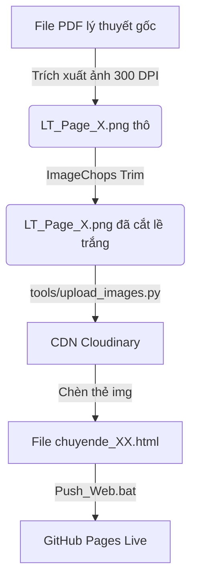

# 📋 Hướng Dẫn Quy Trình Trích Xuất & Đẩy Lý Thuyết Dạng Ảnh

Tài liệu này ghi lại quy trình chuẩn hóa và tự động hóa việc đưa lý thuyết dạng PDF (hoặc ảnh gốc) vào phân mục Lý thuyết của các chuyên đề bài tập tương tác Toán Cá Chép. Quy trình này khắc phục triệt để lỗi phân rã ký tự (OCR lỗi) và lỗi khoảng trắng thưa thớt giữa các trang ảnh.

---

## 💡 Tổng Quan Nguyên Lý Hoạt Động



---

## 🛠️ Quy Trình 5 Bước Thực Hiện Chi Tiết

### BƯỚC 1: Chuẩn bị nguyên liệu PDF lý thuyết
Ném tệp PDF lý thuyết gốc của chuyên đề vào thư mục hình ảnh đầu vào của chuyên đề tương ứng:
* Đường dẫn mẫu: `01_Inputs/chuyende_xx/pic/lythuyetcd6.pdf` (Thay `chuyende_xx` bằng thư mục chuyên đề thực tế).

### BƯỚC 2: Tách trang PDF & Tự động cắt lề trắng (Trim white margins)
Tí đã xây dựng kịch bản tự động hóa [pdf_to_images_cropped.py](file:///c:/Users/huyds/OneDrive/2.%20PARA/1%20-%20Projects/CaChep_Ecosystem/02_Distribution/List_Chuyende_Web/scratch/pdf_to_images_cropped.py) đặt trong thư mục `scratch/`. Kịch bản này sử dụng:
1. `PyMuPDF (fitz)` để kết xuất từng trang PDF sang ảnh PNG ở độ nét cao (zoom = 4.16 ~ 300 DPI).
2. `Pillow (ImageChops.difference)` để quét toàn bộ pixel biên màu trắng tinh/gần trắng và cắt phăng lề trống dư thừa ở cả 4 phía, chừa lại chính xác **20px padding** mềm mại để ảnh thoáng mà không bị thưa.

**Cách chạy lệnh:**
```powershell
# Chạy script xử lý ảnh trong PowerShell
$env:PYTHONIOENCODING="utf-8"
python scratch/pdf_to_images_cropped.py
```
*Kết quả:* Các ảnh sạch lề `LT_Page_1.png` đến `LT_Page_5.png` sẽ xuất hiện ngay tại thư mục `01_Inputs/chuyende_xx/pic/`.

### BƯỚC 3: Đẩy ảnh lý thuyết lên Cloudinary
Sử dụng script Python chính thức của hệ thống để đẩy tất cả ảnh nguyên liệu lên CDN:
```powershell
$env:PYTHONIOENCODING="utf-8"
python tools/upload_images.py chuyende_xx
```
*Kết quả:* Script sẽ in ra danh sách thẻ HTML có sẵn URL Cloudinary bảo mật trực tuyến dạng:
```html
<!-- LT_Page_1.png -->

```

### BƯỚC 4: Chèn các liên kết ảnh vào HTML chuyên đề
1. Mở file HTML chuyên đề tương ứng trong `03_Outputs/chuyende_xx.html`.
2. Định vị thẻ `<div class="theory-text" id="theory-content" ...>`.
3. Thay thế toàn bộ mã văn bản/bảng biểu KaTeX cũ bên trong nó bằng các thẻ ảnh đã bọc trong `.img-wrap`:
```html
<div class="theory-text" id="theory-content" style="font-size:16px; line-height:1.8; color:#334155; padding: 10px 0;">
    <div class="img-wrap">
        
    </div>
    <div class="img-wrap">
        
    </div>
    <!-- Lặp lại cho tất cả các trang ảnh -->
</div>
```
*(Lưu ý: Không cần thêm thuộc tính viền xanh dương vì Tí đã loại bỏ viền này để giao diện flat sạch sẽ).*

### BƯỚC 5: Đồng bộ hóa & Triển khai lên Web
Chạy robot `sync_chuyende.ps1` để tự động hóa toàn bộ khâu đóng gói bảo mật và đẩy trực tiếp lên GitHub Pages:
```powershell
powershell -ExecutionPolicy Bypass -File sync_chuyende.ps1
```
Hoặc đơn giản là nhấn đúp chuột vào file **`Push_Web.bat`** ở thư mục gốc của dự án!

---

## 📌 Các File Kịch Bản Tí Đã Tạo Trong scratch/

1. **[pdf_to_images_cropped.py](file:///c:/Users/huyds/OneDrive/2.%20PARA/1%20-%20Projects/CaChep_Ecosystem/02_Distribution/List_Chuyende_Web/scratch/pdf_to_images_cropped.py)**: Tách PDF sang ảnh PNG 300 DPI + Tự động cắt sạch lề trắng dư thừa bằng Pillow.
2. **[replace_theory.py](file:///c:/Users/huyds/OneDrive/2.%20PARA/1%20-%20Projects/CaChep_Ecosystem/02_Distribution/List_Chuyende_Web/scratch/replace_theory.py)**: Script tiện ích tự động tìm khối text lý thuyết cũ trong HTML để thay bằng mã chèn ảnh lý thuyết.
